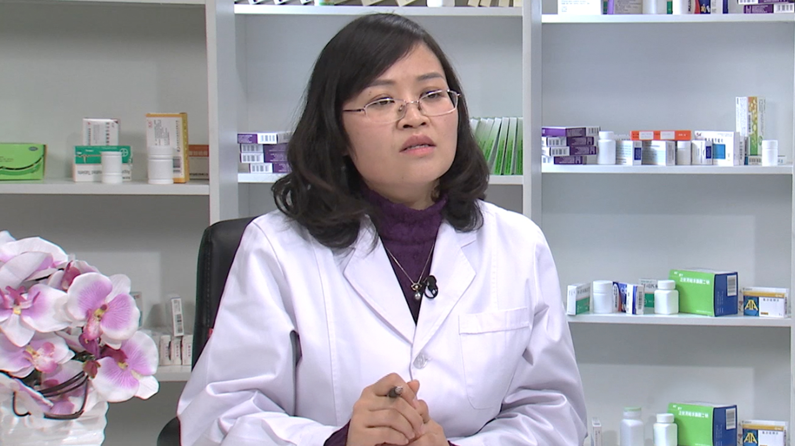

# 26.165 硝酸甘油//张青霞药师

---

## 张青霞 副主任药师

首都医科大学宣武医院心内科副主任药师  药学硕士.

国家卫计委临床药师带教师资 ；全国老年药学联盟常务理事兼秘书长 ；中国药理学会药源性专业委员会心血管分委会委员兼秘书 ；药物不良反应杂志社青年编委；中国医学论坛报用药安全专栏编委；北京市职工技术协会“高技能人才” ；卫生部合理用药国际网络（INRUD）中国中心组临床安全用药组秘书 ；北京市卫生计生委临床安全用药组 秘书 ；京医通优秀科普作者 。

**主要成就 ：** 第一作者发表论文10余篇，致力于心血管用药及安全用药。

**专业特长：** 擅长于心血管用药、慢病用药管理及安全合理用药。

---
