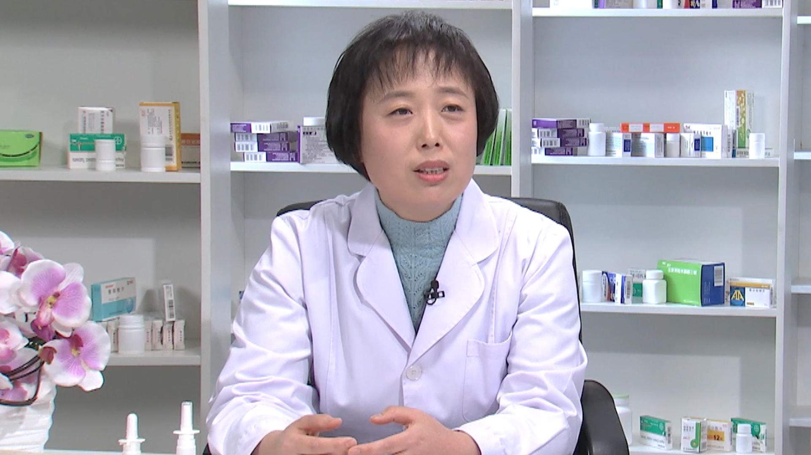

# 26.172 盐酸氮卓斯汀鼻喷雾剂

---

## 王海莲 副主任药师

首都医科大学宣武医院药剂科。

中国首期药物治疗管理药师；北京药学会优秀药师；北京市22家医院药师咨询技能竟赛亚军；2017年度中国十大卓越药师；2017年首届十大网络影响力药师提名奖。

**主要成就：** 发表核心期刊论文30余篇，副主编专著2部。

**专业特长：** 专职用药咨询，擅长高血压、糖尿病、高脂血症、脑血管病、老年性痴呆、哮喘、青光眼等疾病。

---
