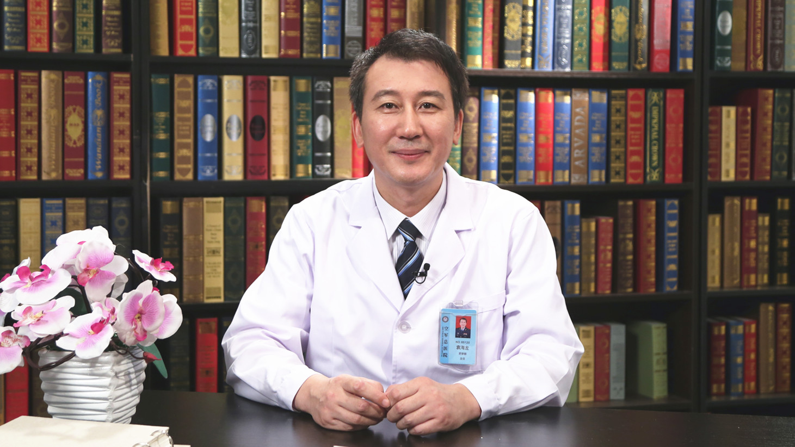

# 26.174 药师助力合理用药

---

## 袁海龙 主任药师

空军总医院药学部主任 主任药师 博士生导师。

全军药学专业委员会制剂分会副主任委员；全军药学专业委员会中药天然产物分会副主任委员。

**主要成就：** 以第一作者或通讯作者发表SCI论文40余篇，单篇最高影响因子7.37分；以第一负责人主持国家新药创制重大专项2项、国家自然科学基金2项、军队后勤目录重点项目、北京市科委重点项目、北京市自然科学基金等项目11项；以第一完成人国家发明专利授权7项；获国家、军队省部级二等奖以上奖项6项。

**专业特长：** 擅长合理用药和医院药事管理，中药新型给药系统。

---
