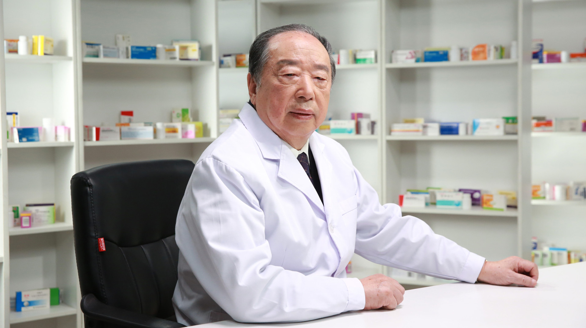

# 26.175 药物不良反应

---

## 孙忠实 主任药师

曾任中国人民解放军总医院第六医学中心（海军总医院）药剂科主任 主任药师。

曾任国家食品药品监督管理局药品评价中心专家 ；现任国家卫计委全国合理用药监测系统专家 ；中国国家处方集办公室核心专家 ；中国非处方药物协会专家 ；国家食品药品监督管理局执业药师培训中心专家 ；首都医科大学临床药理系客座教授。

**主要成就：** 《药学堂杂志》主编，《中国医药导刊》《中国医院用药评价与分析》杂志副主编，《中国执业药师杂志》《自我药疗》学术顾问，《中国处方药杂志》《药品评价杂志》《医药世界杂志》《中国全科医生杂志》编委；曾任《中国药学杂志》《中国医院药学杂志》《中国新药杂志》《药物不良反应杂志》编委；曾主编或副主编专业书刊10余本，发表论文260余篇；曾获全军科技进步奖10余项。

**专业特长：** 重点学习与关注临床药理学,尤其是对新药的临床发展与评价，上市后的药物再评价，药物警戒及药物不良反应监察等,为广大群众用药安全摇旗呐喊。

---
