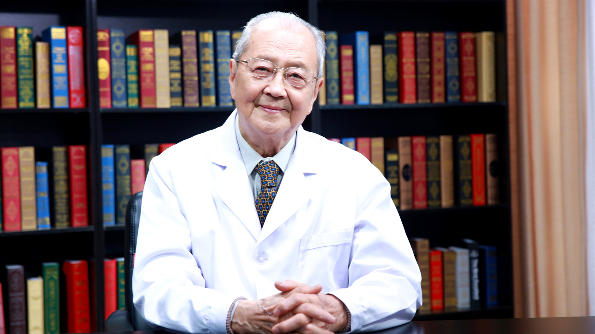

# 26.176 药物与人

---

## 金有豫 教授

曾任首都医科大学药理学教授 药理学教研室主任 药物研究所所长。

现任国家药典委员会第11届委员会特邀委员；曾任国家自然科学基金评审委员会委员；曾任原卫生部高等院校教材评审委员会委员；曾任全国高等院校临床药学教材评审委员会顾问 。

**主要译著：** 《新编药物学》《治疗学的药理学基础》《马丁代尔药物大典》《中国药典临床用药须知》《中国国家处方集》和药理学教材多本。

**专业特长：** 药理学教学和科学研究；科研重点为心血管系统和血小板药理学。

---
