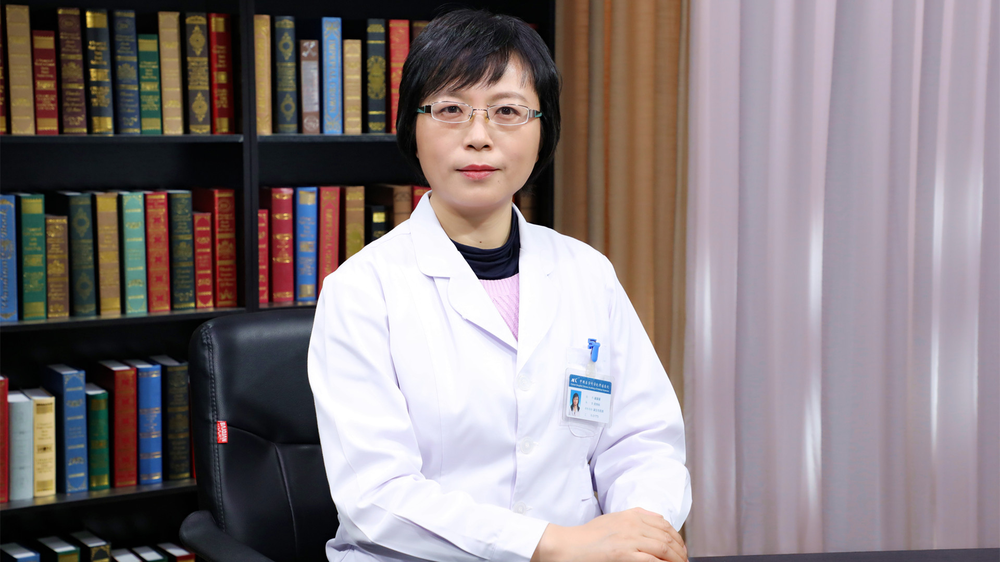

# 26.183 依西美坦

---

## 戴媛媛 副主任药师

中国医学科学院肿瘤医院药剂科副主任。

中国抗癌协会肿瘤临床药学专业委员会秘书长；中国健康促进基金会医药知识管理专项基金专家委员会委员；中国药学会医院药学专业委员会肿瘤学组秘书。

**主要成就：** 获得美国MTM药师资格，主持和参与各类基金课题10余项，发表论文多篇。

**专业特长：** 擅长肿瘤药学服务和药事管理工作，在肿瘤患者药物治疗管理、药物合理使用以及患者健康生活干预等方面富有经验。

---
