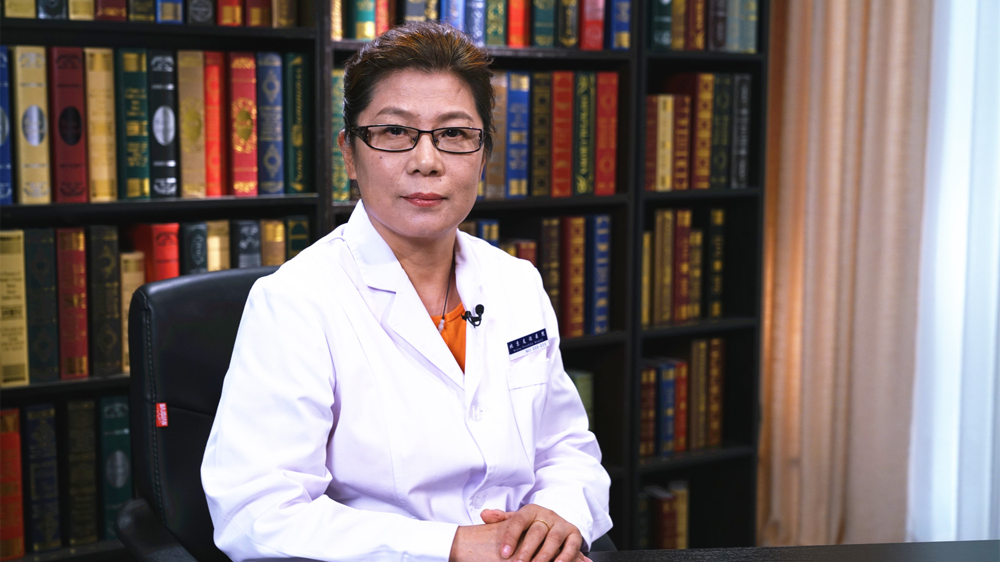

# 26.187 幽门螺杆菌患者的合理用药

---

## 沈素 主任药师

首都医科大学附属北京友谊医院药剂科副主任 副教授 硕士生导师。

中国医药教育协会临床合理用药专业委员会消化疾病分委会主任；中国医院协会药事管理专业委员会委员；中国医疗保健国际交流促进会药学信息化分会常务委员；北京医学会临床药学分会常务委员。

**主要成就：** 担任《中国医刊》《中国医院用药分析与评价》《临床药物治疗杂志》《首都食品与医药》等杂志编委；发表药学专业论文50余篇，参编《新编药物学》《国家基本药物处方集》《药学监护--临床用药安全指南》《临床药物治疗学》等30余部书籍。

**专业特长：** 在医院药事管理、临床合理用药评价与用药监测、患者用药安全等方面具有丰富的实践经验。长期关注公众用药科普及宣教，从学校、社区、军营到农村、边远贫困地区进行药学授课，提升全民安全用药意识和健康素养。

---
