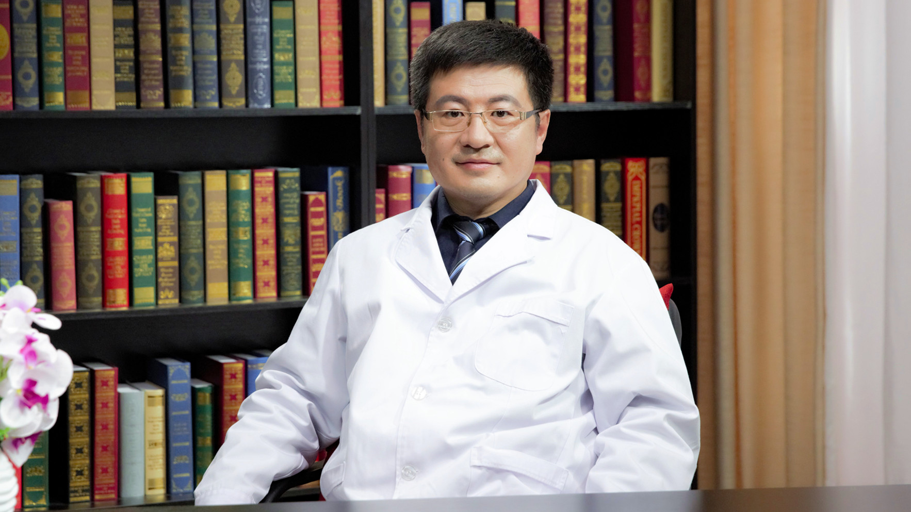

# 27.1 瘢痕疙瘩（疤痕疙瘩）

---

## 王连召 主任医师

中国医学科学院整形外科医院瘢痕综合治疗科主任 主任医师。

中国整形美容协会瘢痕医学分会副会长；中国修复重建外科学会瘢痕学组副主任委员；中国整形美容协会美容与再生医学分会常务理事；中华医学会医学美学与美容学分会创面与瘢痕修复学组全国委员。

**主要成就：** 致力于瘢痕和瘢痕疙瘩的临床和基础医学研究，承担多项院所课题的研究工作，发表SCI和核心期刊文章十余篇。

**专业特长：** 擅长瘢痕和瘢痕疙瘩的预防和治疗。

---
