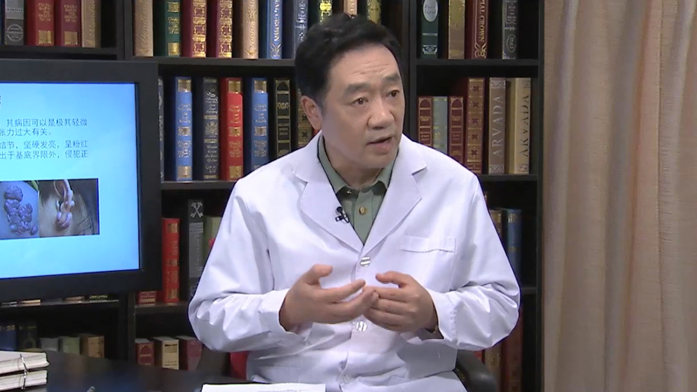

# 27.2 瘢痕修复

---

## 贾赤宇 主任医师

解放军第309医院整形美容烧伤修复中心主任 主任医师 博士生导师。

中国研究型医院学会医学美容分会主任委员 ；中华医学会烧伤外科学分会常务委员；中国医师协会烧伤科医师分会名誉会长 ；解放军医学技术委员会烧伤分会副主任委员 ；中国康复医学会修复重建外科专业委员会北京分会副主任委员侯任主任委员 。

**主要成就：** 发表论文264篇，参编专著26部；致力于烧烫伤救治、瘢痕防治、难愈合创面的基础与临床研究，系列研究获得多项国家、军队、省部级科技进步奖，黎鳌烧伤医学奖和盛志勇医学奖，军队优秀人才岗位津贴；先后承担国家级、省部级等科研课题17项；2017年获得黎鳌烧伤医学奖二等奖。

**专业特长：** 擅长于危重烧烫伤的救治，瘢痕防治，各种难愈性创面（褥疮、糖尿病足）的治疗。尤其对结核性创面有深入的研究。

---
