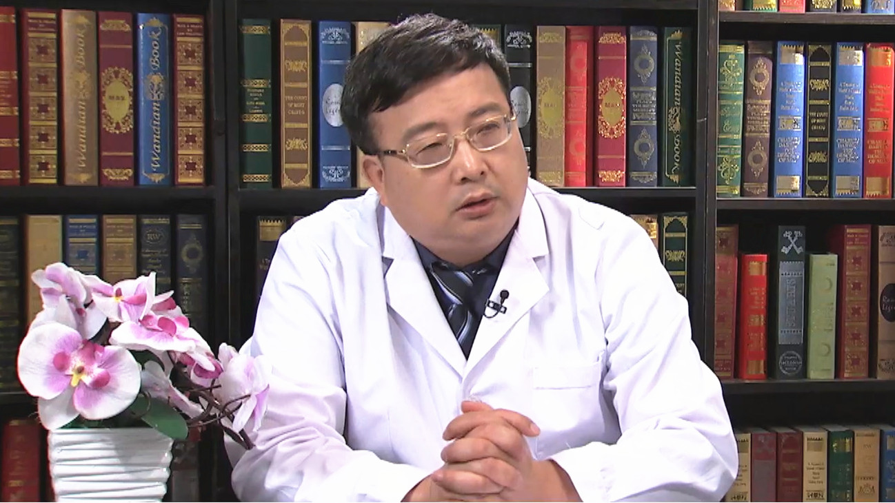

# 27.5 鼻头缩小术

---

## 谢洋春 主任医师

中国医学科学院整形外科医院北院副院长 主任医师 硕士生导师。

中国医师协会美容与整形医师分会鼻整形组委员；中华整形外科协会会员；中华整形外科协会瘢痕修复专业委员会委员；北京市石景山区专家库成员；《中国美容整形外科杂志》编委；《中华医学美学美容杂志》特约审稿人。

**主要成就：** 每年完成近1200例的各种手术，其中严重先天畸形、各种美容手术最多见；参与国家级课题6项，其中1999年参与的项目获得卫生部科技进步三等奖；在国家级继续教育讲课5次，带教进修生30多人，协助带教研究生近20人；发表科普文章近1000篇，2005年曾获论文数量第三名。

**专业特长：** 擅长面部年轻化手术，重睑、袪眼袋、各种眼睑畸形矫正（上眼睑下垂，内翻倒睫等；擅长各种鼻部美容整形手术（鼻头缩小，驼峰鼻矫正，隆鼻等）及各种鼻子缺损修复；擅长口角开大、厚唇修薄、隆下颌、面部轮廓矫正、面部脂肪抽吸、小切口腋臭根治、耳廓畸形矫正、耳垂裂及先天性无耳再造、各种体表肿瘤、各种器官再造等。

---
