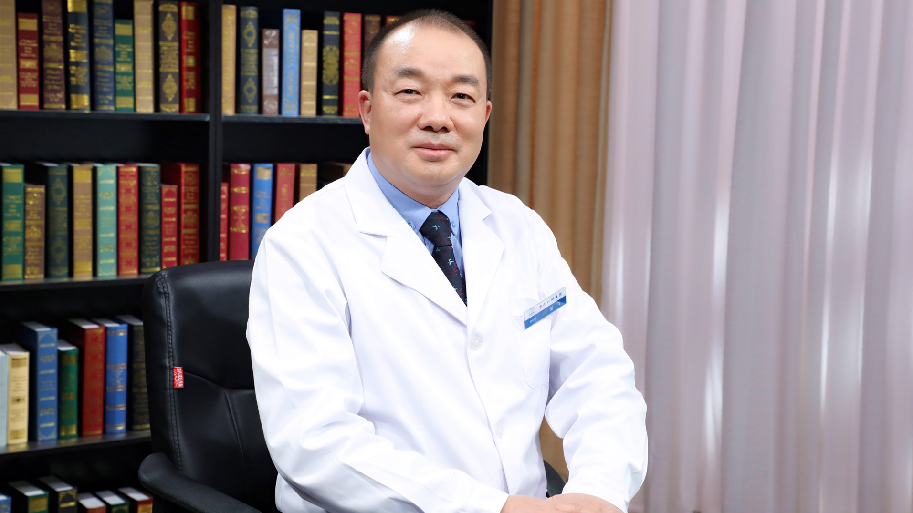

# 27.6 鼻再造

---

## 范飞 主任医师

中国医学科学院整形外科医院鼻整形与再造中心主任 主任医师 博士生导师 国家二级教授。

中华医学会整形外科学分会鼻整形学组组长(2014-2017)；中华医学会整形外科学分会鼻整形学组特约顾问；中国整形美容协会鼻整形分会常务委员。

**主要成就：** 发表核心论文50余篇，其中SCI论文30余篇；主持重点科研项目10项；参与编译图书《现代整形外科治疗学》《临床技术操作规范·整形外科分册》《整形外科特色治疗技术》等专著；在组织工程软骨构建方面首次通过3D打印辅助技术构建了外观精细的鼻翼软骨支架；在鼻部美容手术方面，倡导微创切口自体肋软骨采取术，改进Dallas鼻整形术式，形成了一套符合中国人鼻部美学特征的隆鼻术式。

**专业特长：** 擅长运用各种术式解决鼻部缺损问题，尤其是全鼻再造、鼻面部瘢痕修复、鼻部美容手术。

---
