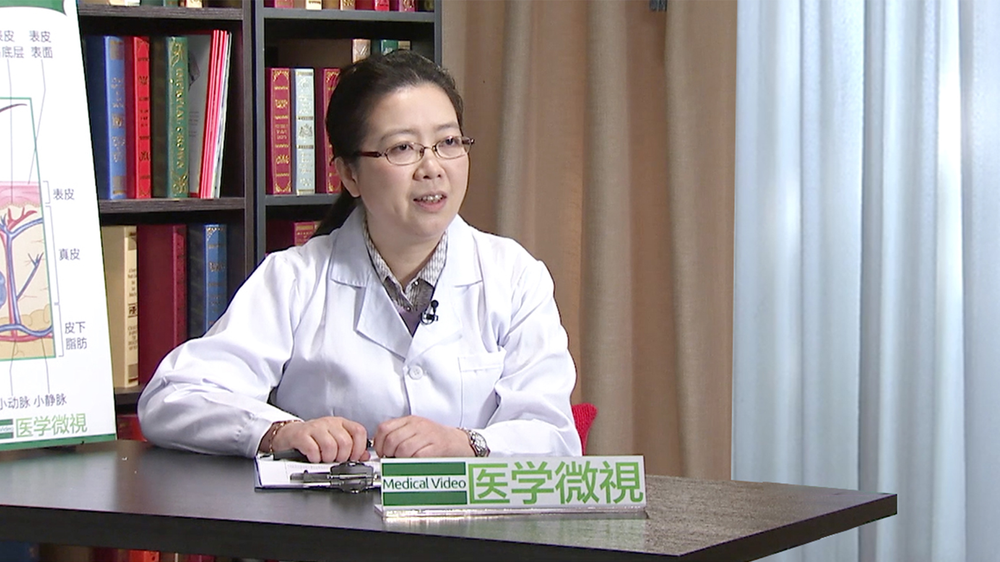

# 27.10 痤疮

---

## 蔡林 主任医师

北京大学人民医院皮肤科主任医师 硕士生导师。

中华医学会皮肤性病委员会治疗学组委员；中华医学会北京分会皮肤科委员会委员；卫生部医疗事故技术鉴定专家库成员；北京市劳动能力鉴定委员会医疗卫生专家库成员；北京大学医学部住院医师规范化培训皮肤病与性病学考核组专家。

**主要成就：** 曾获得国家自然科学基金、中华医学会基金及北京大学985科研基金等基金资助；在国内、外核心期刊发表论文70余篇（其中SCI 近10余篇）, 参与著书7部；先后在日本富山医科药科大学皮肤科（2004年）和悉尼大学Westmead医院传染病与微生物研究中心（2007年-2008年）作高级访问学者。

**专业特长：** 擅长银屑病、白癜风、毛发及痤疮、过敏及感染等各种疑难皮肤疾病的诊治。

---
