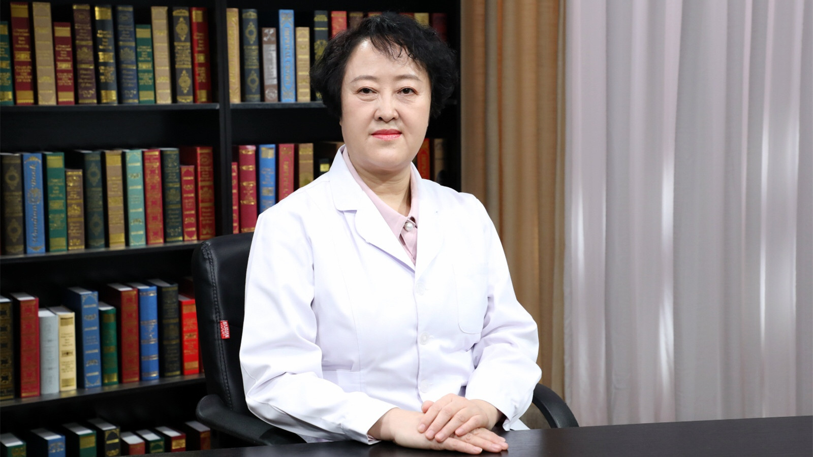

# 27.12 耳廓再造术

---

## 杨庆华 主任医师

中国医学科学院整形外科医院耳整形再造一中心主任 主任医师 博士生导师。

中华医学会整形外科学分会耳再造学组副组长；中国职业安全健康协会医美与整形安全专业委员会副主任委员；中国女医师协会美容与整形医师分会会员。

**主要成就：** 承担国家自然科学基金项目、卫生部临床学科重点项目等6项科研课题；曾获宋庆龄儿科医学奖、北京市科技进步奖等奖项；先后在国内外学术期刊发表论文50余篇，参编《整形外科特色治疗技术》《临床技术操作规范－整形外科分册》等论著。

**专业特长：** 擅长整形、美容外科手术，如面部除皱术、重睑成形术、下睑袋去除术、隆鼻术、脂肪抽吸体形雕塑、烧伤后瘢痕整形等，尤其对先天性小耳畸形、外伤性耳廓缺损的修复手术有深入研究，积累了丰富的治疗各种复杂耳廓畸形的临床经验。

---
