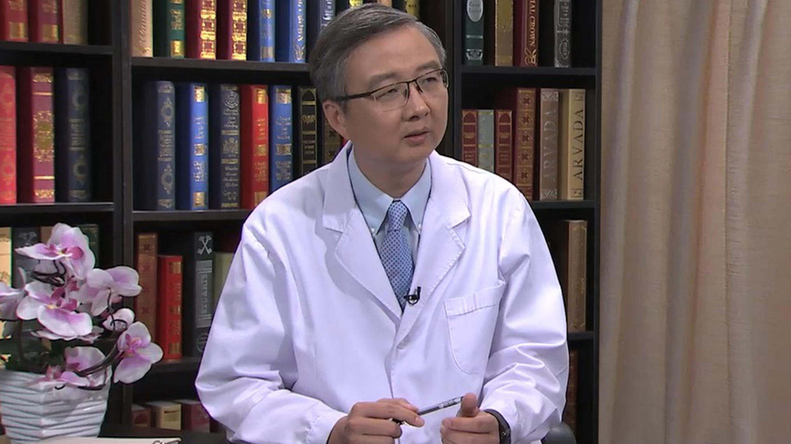

# 27.14 儿童牙齿正畸

---

## 厉松 主任医师

首都医科大学附属北京口腔医院副院长。

首都医科大学附属北京口腔医院 主任医师 研究生导师；北京市牙病防治所副所长；世界正畸联盟（WFO）理事；中华口腔医学会理事；中华口腔医学会正畸专委会常委；北京口腔医学会正畸专委会副主任委员；国际牙医师学院（ICD）院士；英国爱丁堡皇家外科学院正畸专科院士；美国正畸协会（AAO）会员；国际牙科研究会（IADR）会员；“中华口腔正畸学杂志”编委，“北京口腔医学杂志”编委。

**主要成就：** 承担国家自然科学基金面上项目两项，其余省部级研究基金十余项；翻译、参编著作八部；发表学术论文八十余篇。

**专业特长：** 擅长儿童及成人各类错颌畸形的诊断与治疗。

---
