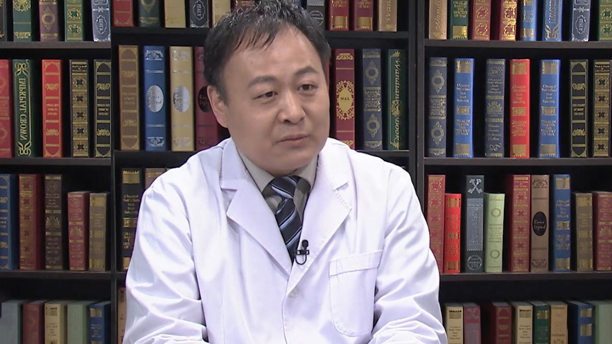

# 27.16 颌面整形

---

## 牛峰 主任医师

中国医学科学院整形外科医院颅颌面中心主任 医学博士 主任医师。

**主要成就：** 主刀完成了上万例颅颌面外科手术和其它部位的整形手术。

**专业特长：** 擅长颅颌面美容整形（下颌角、颧骨和颏部美容、头面部的脂肪填充以及重睑、眼袋等手术）以及采用正颌外科手术矫治各种牙颌面发育性畸形（地包天、小下颌、尖嘴、面中份发育不足）

---
