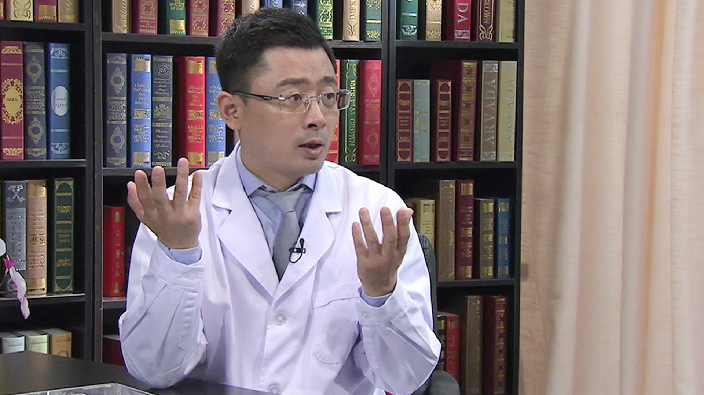

# 27.20 隆鼻

---

## 范巨峰 主任医师

首都医科大学附属北京朝阳医院整形外科主任 主任医师 研究生导师。

中华医学会医学美学与美容学分会全国委员；中华医学会医学美学与美容学分会美容技术学组组长；中华医学会整形外科学会北京分会委员；中国医师协会美容与整形医师分会常务委员；中国医师协会美容与整形医师分会瘢痕亚专业委员会委员；中国中西医结合学会医学美容专业委员会注射美容专家委员会主任委员。

**主要成就：** 承担包括国家自然基金、卫生部临床重点项目基金等多项科研项目；承担首都医科大学基础临床联合课题；主编《注射美容外科学》《简明美容外科手术精要（精）》；主译《麦卡锡整形外科学》。

**专业特****长****：** 擅长注射美容外科、激光美容整形、乳房美容整形（隆胸、巨乳缩小、乳癌术后乳房再造、微创副乳腺矫治术、微创男性乳腺发育矫治术）、面部美容整形（重睑、眼袋、隆鼻、除皱）、各种鼻整形、各种瘢痕治疗、下颌角手术、包皮环切术（微创）、腋臭治疗等。

---
