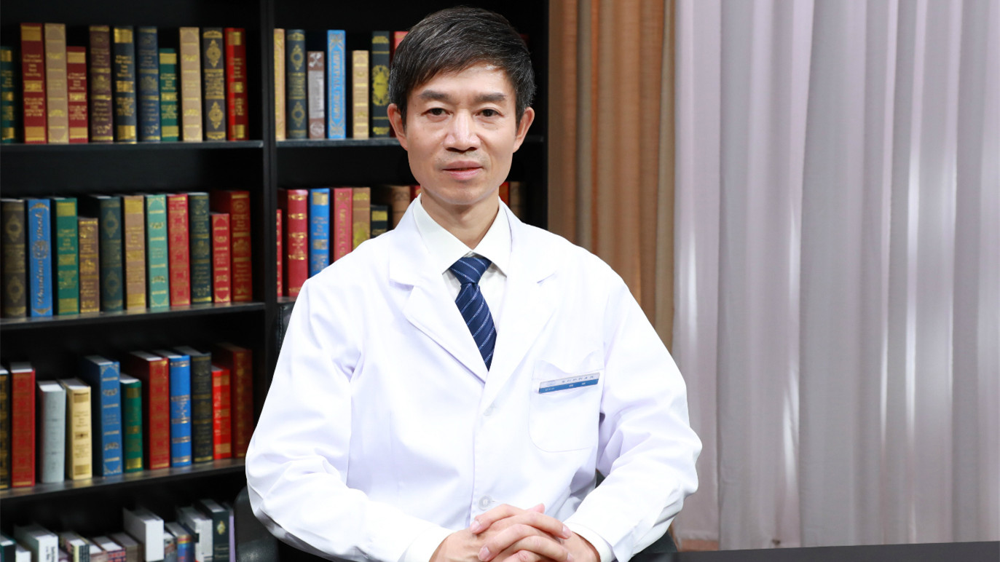

# 27.22 面部轮廓整形

---

## 杨斌 主任医师

中国医学科学院整形外科医院颌面外科数字化整形中心主任 主任医师 博士研究生导师。

中华医学会整形外科分会颅颌面外科学组委员；中国整形美容协会颅颌面外科分会副会长；中国整形美容协会精准与数字化医学分会副会长；中国康复医学会修复重建外科专业委员会常委 颅颌面外科学组组长；《中华医学美学美容杂志》编委。

**主要成就：** 多年来致力于颅颌面整形外科及数字化医学技术的临床、科研和教学工作，治愈各种颅颌面畸形患者数千例；主持和负责国家级、部市级科研项目10多项，荣获部省级科技进步奖；主编出版《颅颌面外科学》和《实用美容整形外科手术学》，发表核心期刊和SCI期刊学术论文80多篇。

**专业特长：** 从事整形外科、颌面外科工作30年，具有精湛的临床医疗技能和丰富的临床实践经验。擅长于先天性颅面畸形整复外科手术治疗、创伤性颅颌面畸形和颅骨缺损的修复重建、牙颌畸形的正颌正畸联合治疗、面部轮廓美容整形手术。

---
