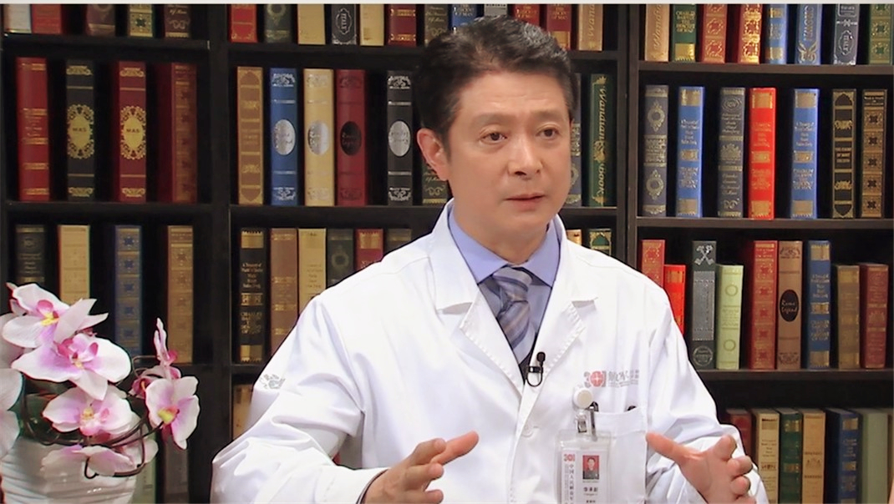

# 27.25 皮肤激光美容

---

## 李承新 主任医师

中国人民解放军总医院皮肤科主任 主任医师 博士研究生导师。

中国中西医结合学会变态反应专业委员会候任主任委员；中国整形美容协会激光美容分会副会长；全军皮肤病专业委员会副主任委员；北京医学会皮肤性病学分会副主任委员。

**主要成就：** 教育部新世纪优秀人才、中国人民解放军总后勤部科技新星；先后承担国家“863”计划课题（3项）、国家自然科学基金课题（5项）等10余项科研课题，发表论文100余篇，其中SCI收录20余篇；获国家科技进步三等奖和陕西省科技进步一等奖各一项（均为第二作者）。

**专业特长：** 擅长银屑病、过敏性皮肤病、激光美容、皮肤肿瘤的临床诊治。

---
