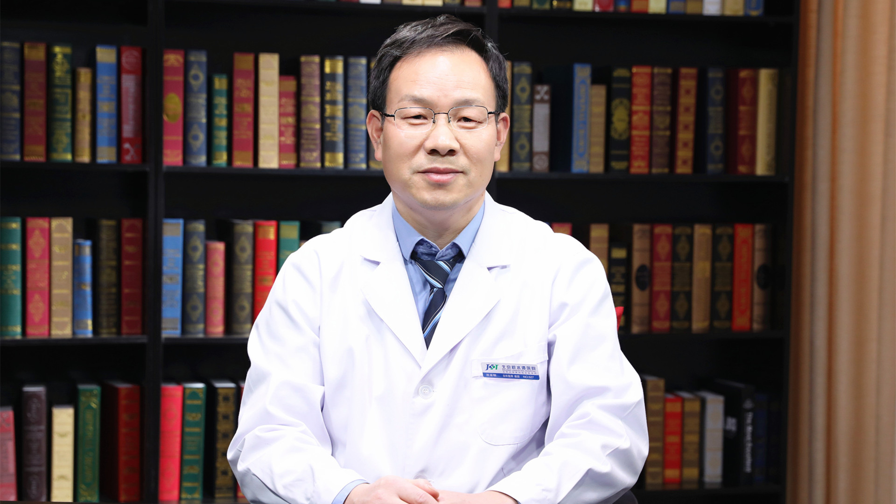

# 27.26 烧烫伤创面修复

---

## 沈余明 主任医师

北京积水潭医院烧伤科主任 主任医师 医学硕士。

第五届中央保健会诊专家 ；中华医学会烧伤外科学分会常委 ；北京医学会烧伤外科学分会主任委员 ；中国非公立医疗机构协会损伤与修复专业委员会主任委员 ；中国医药教育协会烧伤专业委员会副主任委员 ；中国研究型医院学会创面防治与损伤组织修复专业委员会副主任委员 。

**主要成就：** 以第一作者或通讯作者在核心期刊发表论文45篇，其中SCI 4篇；主编1部，主译1部，参与专著编写8部；获北京市科学技术进步二等奖2项，北京市卫生局技术改进奖1项。

**专业特长：** 擅长烧伤、瘢痕整形及创面修复重建，特别是深度复杂性创面组织修复。对高压电烧伤、创伤性皮肤缺损、骨外露、慢性骨髓炎、褥疮、放射性溃疡、糖尿病足及其它难治性创面均有丰富的治疗经验。

---
