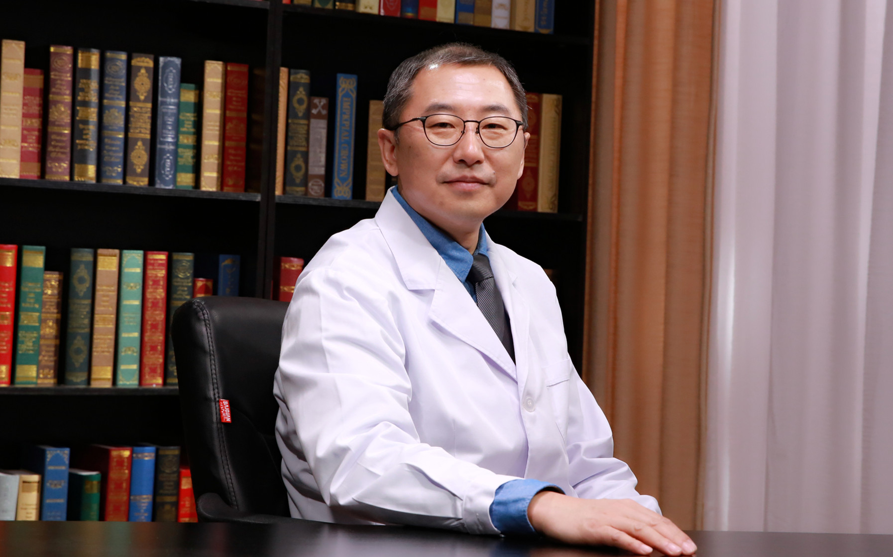

# 27.32 先天性鼻部畸形

---

## 尹宁北 主任医师

中国医学科学院整形外科医院唇腭裂中心主任 主任医师 医学博士 博士生导师。

中华医学会整形外科学分会委员 唇腭裂学组组长；中华口腔医学会唇腭裂专业委员会副主任委员（候任主任委员）；中国医师协会小儿整形外科专业委员会副主任委员；中国整形美容协会鼻整形分会副主任委员；中国康复医学会修复重建分会常务委员。

**主要成就：** 于2006年提出唇鼻肌肉复合体以及肌肉张力带的新理论并加以理论生物力学验证和临床实践检验，后逐渐开始被各地医师用于唇裂畸形的治疗，在业内称为“唇鼻肌肉生物力学仿生技术”；参与科技部“国家十三五重点科技研发项目”1项；承担省部级以上科研基金项目10项；发表论文90余篇，以第一作者或通讯作者发表60余篇，其中被SCI收录25篇；论文获2015年度中华医学会“中华系列杂志优秀论文奖”；2017年获中国整形美容协会科技创新奖（一等奖）；2018年获中华医学奖（三等奖）。

**专业特长：** 主要工作领域为整形外科及口腔颌面外科。从业二十五余年，在面部及躯体整形及形态功能重建方面具有较丰富的临床实践经验。

---
