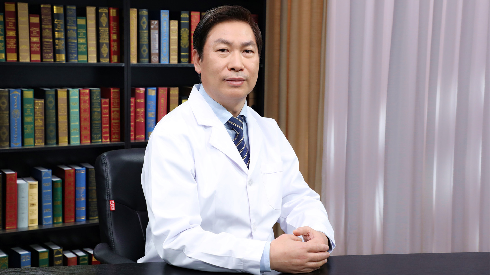

# 27.33 小腿肌肉肥大去薄

---

## 范金财 主任医师

中国医学科学院整形外科医院整形美容九科主任 主任医师.

中国职业安全健康协会医美与整形安全专委会主任委员；中国整形美容协会美容与再生医学分会副会长；中国研究型医院学会烧创伤修复重建与康复专业委员会副主任委员；中国老年保健协会毛发保健与疾病防治专业委员会常务委员；海峡两岸医药卫生交流协会整形美容专家委员会常务委员。

**主要成就：** 发表SCI论文近50篇、核心期刊论文近百篇；应邀出国参加国际整形美容外科学术大会20余次，并在大会演讲论文30余场次；应邀参与编写国际英文专著，出版3部；国外手术演示2次；主持举办国际整形美容外科学术会议2次。

**专业特长：** 擅长烧创伤瘢痕的综合治疗、头面部轮廓美容整形、抗老化综合治疗、眼部美容整形、鼻整形和新式鼻再造、口唇美容整形、乳房与私密整形、吸脂与脂肪注射美体塑形、四肢整形和肌肉缩容瘦小腿、毛发移植、光电与注射微整形。

---
