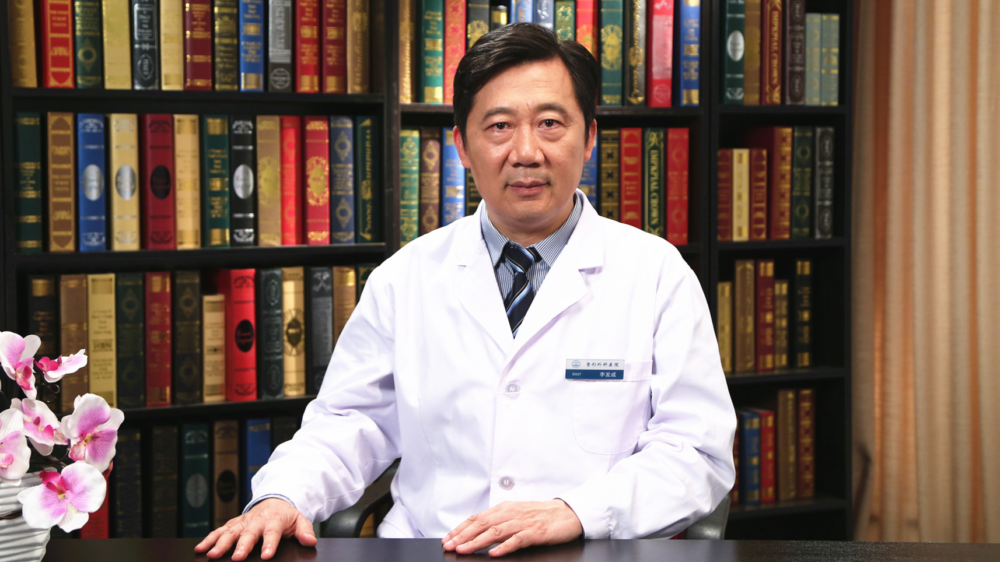

# 27.34 吸脂术

---

## 李发成 主任医师

中国医学科学院整形外科医院十八科主任 主任医师.

中华医学会整形外科分会脂肪移植专业学组组长 ；中国中西医结合学会医学美容专业委员会常务委员 脂肪移植分会侯任主任委员；国际整形再生外科协会Board Member；北京医疗整形美容质量控制和改进中心医疗专家组委员 ；北京医师协会医疗美容专业医师分会常务理事。

**主要成就：** 发表论文30多篇，其中SCI收录6篇；独创脂肪无创处理浓缩技术，脂肪精细定点注射法，在国内率先将吸脂手术与腹壁整形手术有机结合，开展了吸脂腹壁成形术（lipoabdominoplasty），有效解决腹部脂肪堆积和皮肤松弛的问题；针对面部老化问题，提出“5R”原则，从各个角度实现面部年轻化。

**专业特长：** 擅长吸脂及形体雕塑；自体脂肪移植隆乳、自体脂肪移植乳房再造、自体脂肪移植面部轮廓重塑、自体脂肪移植面部年轻化、自体脂肪移植手部年轻化、自体脂肪移植丰臀；腹壁整形；微创面部年轻化；假体隆乳、乳房下垂矫正、巨乳缩小成形术等。

---
