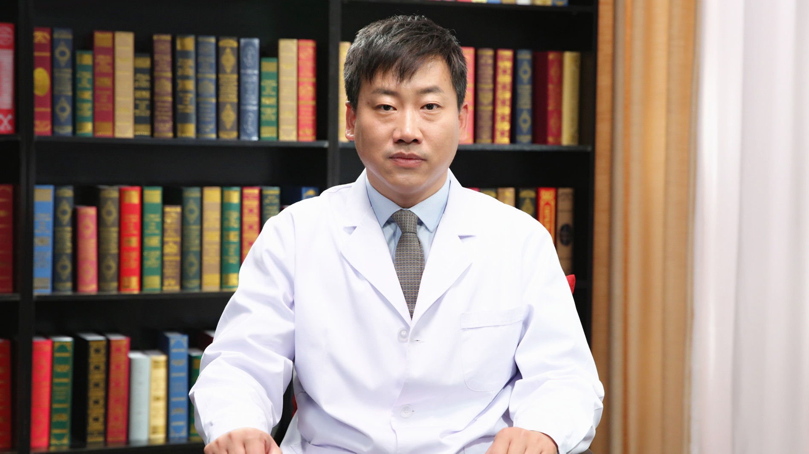

# 27.39 眼袋

---

## 王永前 主任医师

中国医学科学院整形外科医院整形一科行政副主任 主任医师 医学博士 博士研究生导师。

中国整形美容协会美容与再生医学分会副秘书长；中华医学会整形外科学分会唇腭裂学组委员 秘书；中国医师协会美容与整形外科分会眼整形专业委员会常务委员；中国医师协会美容与整形外科分会鼻整形专业委员会委员。

**学术成就:** 2006年获得“中国医学科学院整形外科医院青年岗位能手”称号；2006年获中华医学科技奖三等奖、北京市科学技术奖三等奖；2007年获北京市石景山区科学技术奖三等奖； 2017年获中华医学科技奖三等奖；2017年获北京市石景山区科学技术奖二等奖；2017年获中国整形美容协会创新成果奖；2018年由北京医师协会授予“北京优秀医师”称号。

**专业特长:** 擅长唇、鼻畸形修复：唇裂与腭裂的修复，唇裂继发畸形修复，3D打印辅助齿槽嵴裂修复和鼻整形美容、眼整形、面部年轻化与脂肪移植。

---
