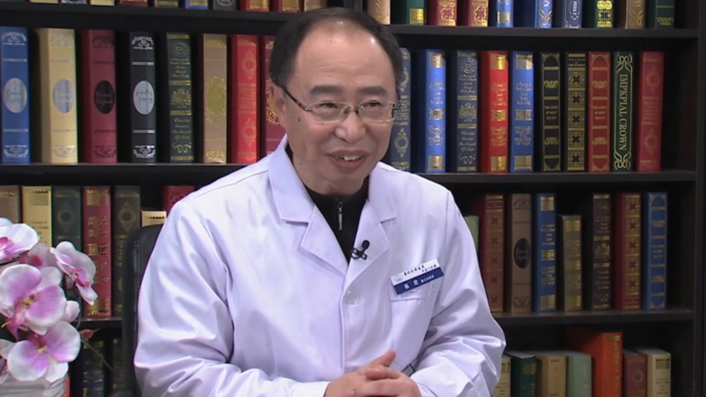

# 27.43 重睑术（双眼皮手术）

---

## 杨欣 主任医师

中国医学科学院整形外科医院平安门诊部医疗主任 医学博士。

面部美容整形专家 形体雕塑专家。

**主要成就：** 《带蒂皮瓣微循环监测及早期断蒂的动物实验与临床应用研究》荣获“1995年院校科技进步奖”三等奖；主持研究的课题《带蒂皮瓣微循环监测及早期断蒂的动物实验与临床应用研究》1996年1月获“一九九五年中国医学科学院、中国协和医科大学院校科技进步奖”三等奖(第一完成者)；参加研究的课题《额部扩张皮瓣同时用于鼻再造与面部缺损修复》1997年5月获得“1995、1996年度中国医学科学院、中国协和医科大学院校医疗成就奖”三等奖；作为研究生导师组成员，协助导师全过程完成6名博士研究生的教学和培养工作，指导数十名进修医师和住院医师的医疗教学工作。

**专业特长：** 擅长面部年轻化（线雕微创悬吊除皱术）；三元立体全鼻精雕术；杨氏微创立体重睑术；无创微点真雕注射术。

---
