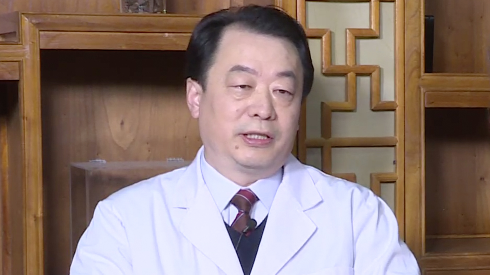

# 28.1 安宫牛黄丸

---

## 陈志刚 主任医师

北京中医药大学东方医院脑病科主任医师 神经内科主任 博士生导师。

中国中西医结合学会神经科专业委员会常务委员；北京中西医结合学会神经科专业委员会副主任委员；北京中医药学会脑病专业委员会副主任委员；北京医学会神经病学分会委员；北京医学会神经病学分会帕金森学组成员。

**主要成就：** 牵头部局级课题1项，首发基金联合攻关课题1项；作为主要研究者参加国家973计划课题、教育部"211建设"中医神经信息学工程建设、北京市科技计划项目、国家自然基金课题、北京市自然基金课题等研究及中药新药2、3期临床研究多项；发表论文50余篇，专著5部。

**专业特长：** 擅长中西医结合治疗脑血管病、重症肌无力、帕金森氏病、多系统萎缩、头痛、眩晕、癫痫、多发性硬化、周围神经病、颈椎病、脑瘫、运动障碍、睡眠障碍、神经痛、神经心理疾病等。

---
