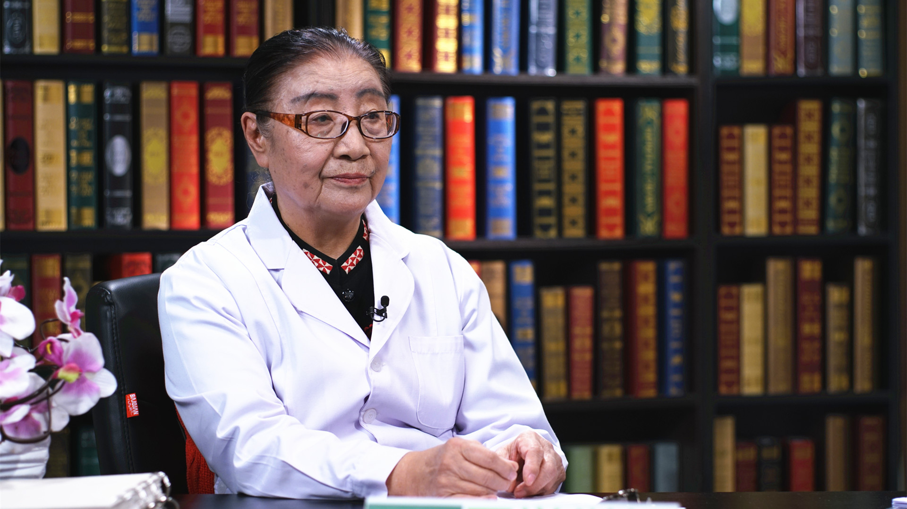

# 28.9 电热针疗法

---

## 夏玉清 主任医师

中国中医科学院望京医院特色诊疗中心电热针室主任 主任医师。

我国著名针灸学家 硕士研究生导师；中国传统医学研究会老年病学组主任委员；中国针灸学会针灸临床研究会理事；世界中医药学会联合会研究员；享受国务院特殊津贴。

**主要成就：** 先后在国内外杂志发表学术论文60余篇；参与编著《国际针灸临床手册》《中国针灸大全》《小儿常用中药处方手册》《中医内科提要》《夕阳红丛书》等书籍；完成了"电热针治疗皮肤癌和女阴白色病变的临床疗效及机理研究"等卫生部级科研课题；荣获世界传统医学大奖赛“金杯奖”。

**专业特长：** 从事临床、科研、教学工作60年。擅长心脑血管病、萎缩性胃炎、女阴白斑、老年病、脑瘫、更年期综合征、进行性肌营养不良等疾病的治疗。

---
