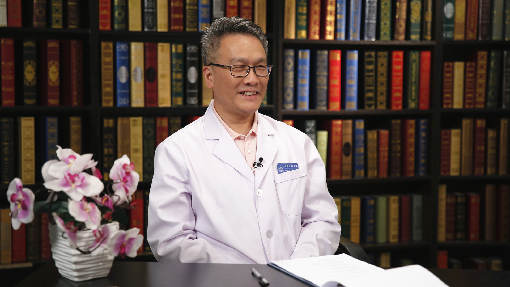

# 28.10 多发性硬化的中医治疗

---

## 樊永平 主任医师

首都医科大学附属北京天坛医院中医科主任 主任医师 博士生导师。

中华中医药学会理事；中华中医药学会脑病专业委员会常委；北京中医药学会脑病专业委员会主任委员；《中华中医药杂志》《北京中医药》《环球中医药》编委。

**主要成就：** 2003年获北京市科技进步奖三等奖，中华中医药学会科技进步奖三等奖；2017年获中华中医药学会科技著作一等奖；2017年入选北京市“高创计划”领军人才；发表论文180篇，编写著作8部；持国家自然科学基金4项，北京市自然科学基金3项；参加国家973、863、国家自然科学基金重点研究计划/国家攻关计划等多项科研课题。

**专业特长：** 擅长中医药治疗神经系统疾病（多发性硬化、视神经脊髓炎、脑肿瘤、脑外伤等）。

---
