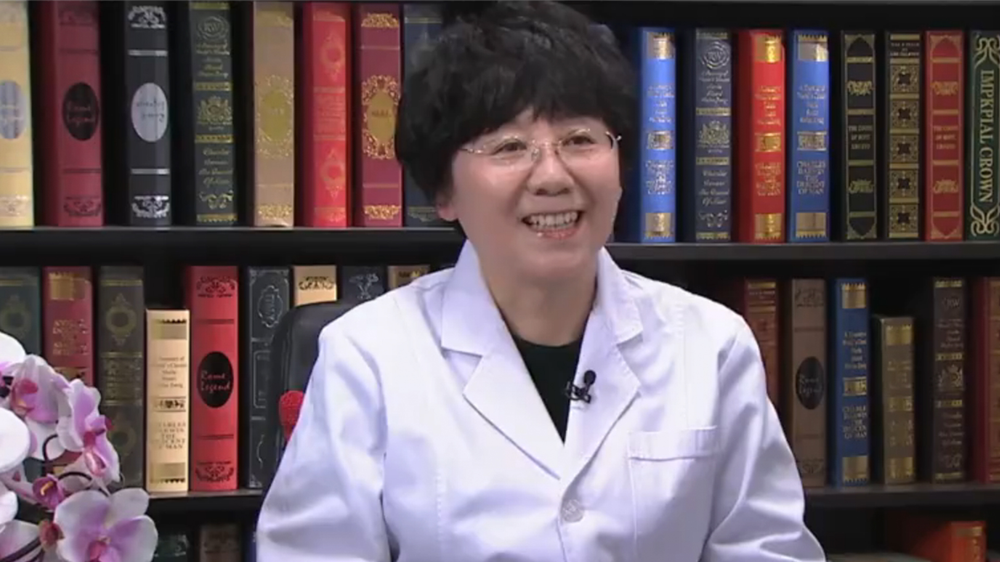

# 28.11 耳鸣耳聋

---

## 刘建华 主任医师

北京中医药大学东直门医院耳鼻喉科主任医师 硕士生导师。

中华中医药学会耳鼻喉科分会常务委员；北京中西医结合学会耳鼻喉科专业委员会副主任委员；北京华夏中医药发展基金会中医耳鼻喉专业委员会副主任委员；中国中药协会药物临床评价研究专业委员会常委；世界中联耳鼻喉口腔科专业委员会第二届理事会常务理事。

**主要成就：** 承担国家中医药管理局科研课题，完成及参与北京中医药大学科研课题10余项；发表学术论文20多篇，主编及参编著作10多部。

**专业特长：** 擅长耳鸣耳聋、眩晕、慢性咽喉炎、咳嗽、过敏性鼻炎、慢性鼻炎、慢性鼻窦炎、腺样体肥大、分泌性中耳炎等。

---
