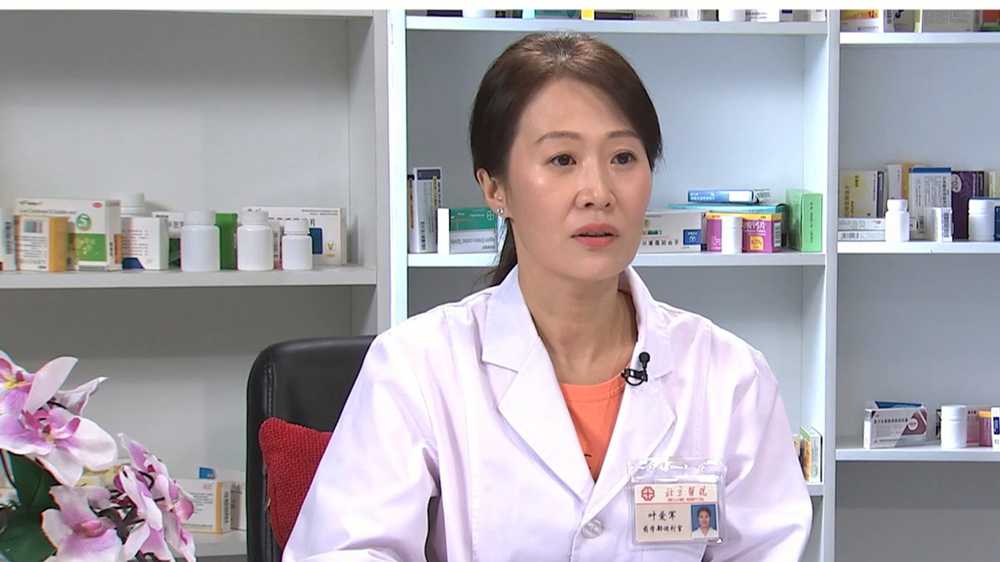

# 28.24 羚羊清肺丸

---

## 叶爱军 副主任药师

北京医院药学部调剂室中药房组长 副主任药师。

北京中医药学会中药调剂专业委员会委员；中药材基地共建共享联盟医院药房专业委员会委员。

**主要成就：** 发表核心期刊10余篇。

**专业特长：** 擅长中药调剂与中药鉴定；善于把控中药饮片质量因素，确保临床一线用药安全；具备中药饮片调剂室丰富管理经验，代教和辅导实习和进修药师，把中药学知识和现代管理知识有机结合，助力传统医药现代化发展。

---
