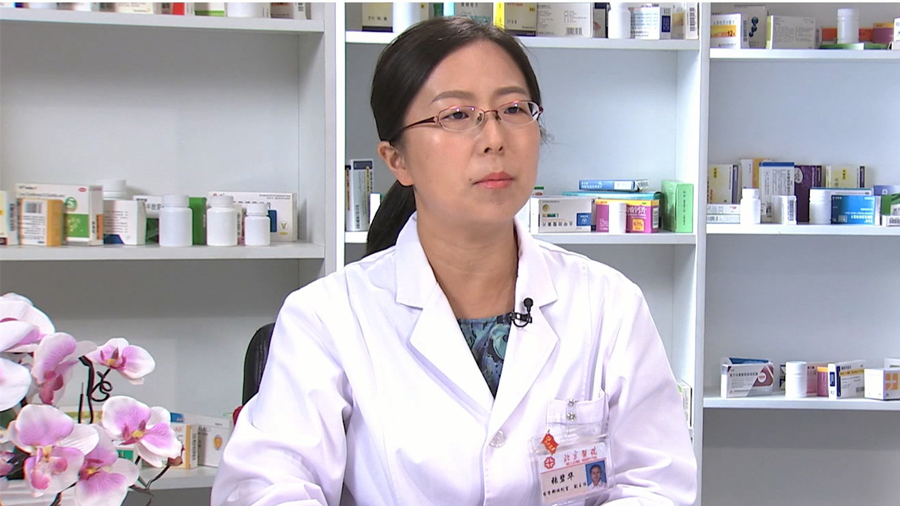

# 28.25 六味地黄丸

---

## 张碧华 副主任药师

北京医院药学部调剂室副主任 副主任药师。

中华中医药学会医院药学分会委员；北京中医药学会药事管理专业委员会副主任委员；北京中医药学会临床合理用药评价专业委员会委员；首批全国中药特色技术传承人才。

**主要成就：** 发表核心期刊论文二十余篇，担任两部人民卫生出版社本科生教材编委；承担及参与多项国家和省部级课题；获评为北京药学会优秀药师——“药学服务之星”，并获得北京药学会、北京中医药学会年会优秀论文奖等多个奖励。

**专业特长：** 现主要从事中药临床药学工作，重点开展中药合理使用及中西药物相互作用等方面的研究，负责我院中药处方点评工作和门诊患者用药咨询工作；与我院中医科联合开设了中医合理用药门诊；负责我院中华中医药学会中药临床药师培训基地和国医大师颜正华临床中药学科服务基地管理。

---
