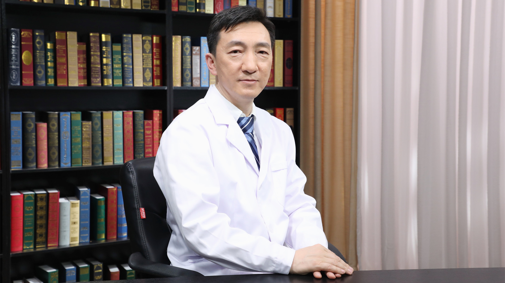

# 28.28 慢性腰痛的中医治疗

---

## 肖京 主任医师

中国中医科学院西苑医院康复医学科主任兼气功推拿科主任 主任医师 医学博士。

中国中医科学院及北京中医药大学硕士生导师；中国中医药研究促进会软组织疼痛分会副主任委员；中国中医药研究促进会针灸康复分会副理事长；中国中西医结合学会疼痛分会常务委员；中国民间中医药研究开发协会针灸教育分会会长；中华中医药学会针刀医学分会委员。

**主要成就：** 发表SCI论文3篇，核心期刊论文42篇，学术专著5部；主持和参与8项省部级以上科研课题，其中3项国家级科研课题，获得国家实用新型发明2项。

**专业特长：** 长期从事脊柱相关疾病及软组织疼痛疾患的中西医结合诊疗及康复的临床及教学工作。近年来致力于中医微创技术的可视化研究及实践，以及运动系统疾病的精准康复。

---
