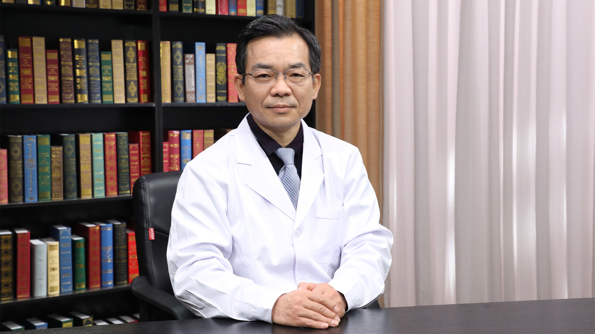

# 28.29 面诊

---

## 秦绍林 主任医师

中国中医科学院眼科医院内科主任 主任医师 医学博士 硕士生导师。

世界中医药学会联合会脑病专业委员会理事；中国民族医药学会国际交流与合作分会常务理事；全国中医药文化科普巡讲团成员。

**主要成就：** 承担并完成国家自然科学基金课题2项，中国中医科学院课题1项；2015年山东省首批高层次中医人才学科骨干。

**专业特长：** 从事内科、神经内科临床工作近三十年，重视中医经典的学习，善于运用中医阴阳五行理论同时调理多系统、多器官疾病；擅长脑血管病的中西医结合治疗、预防及康复。联合运用中药、西药、针刺、艾灸治疗各期脑梗死，收效快速显著；对亚健康、失眠、头痛、眩晕、三叉神经痛、焦虑抑郁症、高血压、冠心病、糖尿病等有良好的疗效。

---
