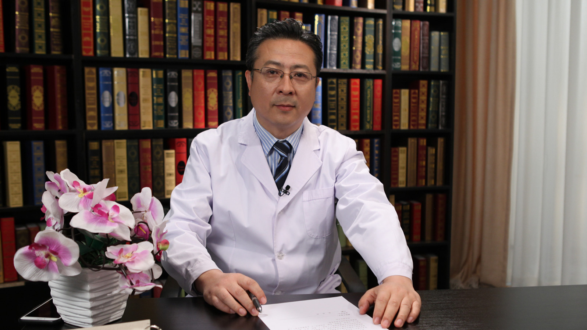

# 28.31 脑梗死的中医治疗

---

## 曹锐 主任医师

首都医科大学附属北京朝阳医院中医科主任 主任医师 教授 研究生导师。

北京市优秀名中医；世界中医药学会联合会脑病专业委员会常务理事；北京中医药学会脑病专业委员会副主任委员；北京中医药学会综合医院中医工作委员会副主任委员；北京中医药学会临床药学专业委会常务委员；北京中西医结合学会呼吸病专业委员会副主任委员。

**主要成就：** 发表相关论文20余篇，参编论著10余部；先后主持完成北京市中医管理局科技发展基金、北京市科学技术委员会、国家中医药管理局行业专项相关课题研究多项；北京市中医药管理局第一批“125计划”优秀中医人才，国家级名老中医经验继承传承人；获北京市科学技术进步奖三等奖。

**专业特长：** 善于运用化痰祛瘀、活血通络、清心养神、健脾扶正等治法，对急性脑血管病进行分型论治，以及恢复期、后遗症期的中医药治疗。

---
