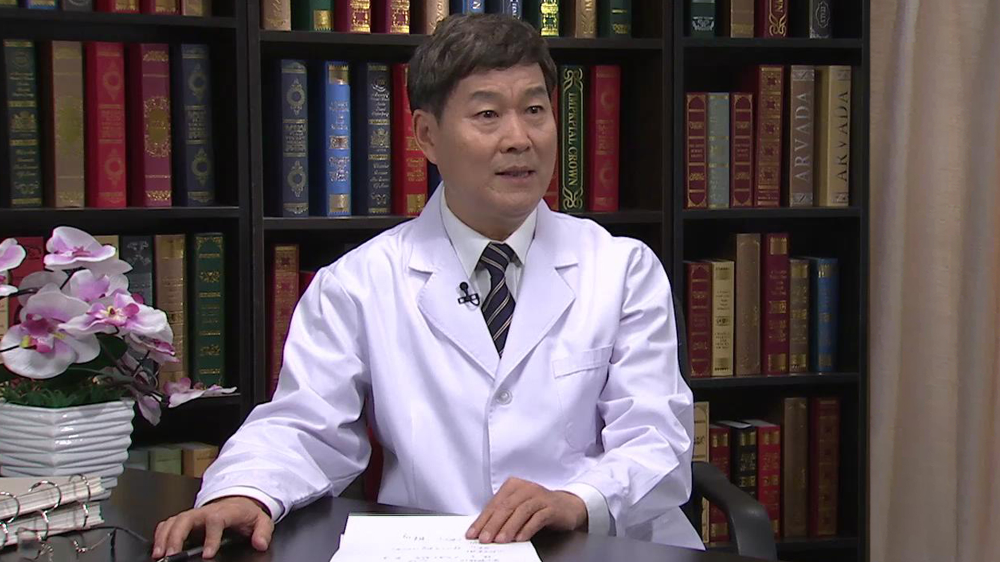

# 28.42 糖尿病的中医治疗//高思华教授

---

## 高思华 主任医师

北京中医药大学首席专家 主任医师 博士生导师。

中国中西医结合学会副会长兼内分泌病专业委员会名誉主任委员；中华中医药学会顾问兼糖尿病分会副主任委员；中国老年保健医学研究会副会长；世界中医药学会联合会内科分会兼糖尿病分会副会长；国家食品药品监管局中药新药兼保健食品审评专家。

**主要成就：** 获省部级科学技术一等奖2项、二等奖1项，省部级教学成果一等奖1项，国家科技进步二等奖和教学成果二等奖各1项；担任国家十二五、十三五规划教材《中医基础理论》的主编，并主编或参编医书10余部，发表学术论文100余篇。

**专业特长：** 从事中医临床工作40余年，擅长中西医结合治疗糖尿病、甲状腺病、内分泌失调、心脑血管疾病、失眠、月经病等内科、妇科疑难病症。对糖尿病的中医治疗研究尤有独到之处，创立了肝脾肾三脏同调辨证治疗糖尿病的基本观点和综合调理模式，更新了中医学对糖尿病的理论认识，并推动了临床疗效的提高。

---
