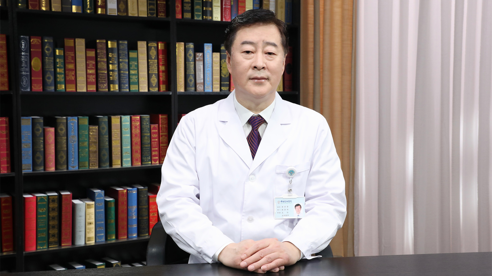

# 28.45 推拿

---

## 唐学章 主任医师

中日友好医院推拿科主任

中央保健委员会中央保健会诊专家；中华中医药学会疼痛学分会主任委员；中华中医药学会推拿分会常务委员；中华中医药学会疼痛与康复学术产业联盟常务理事；中华中医药学会中医药健康产学研联盟专家委员会副主任委员；中国民族医药学会推拿分会副会长；中国医师协会养生专业委员会委员。

**主要成就：** 发表论文三十余篇，出版专著两部；2019年获 “敬佑生命•荣耀医者”中华医药贡献奖；从事中医按摩临床的医疗、教学和科研工作三十余年，在继承和发扬祖国传统医学理论的基础上，不断吸收现代西方医学先进的诊疗技术，在“一指禅推法治疗颈椎病”、“三位八步逐层推拿法治疗腰椎间盘突出症”、“屈髋伸膝斜扳法治疗骶髂关节损伤”等逐步形成了自己的特色，曾多次应邀赴日本、瑞士、美国、哈萨克斯坦等国工作交流。

**专业擅长：** 擅长手法治疗颈椎病、腰椎间盘突出症、骶髂关节损伤、肌筋膜炎等疾患。

---
