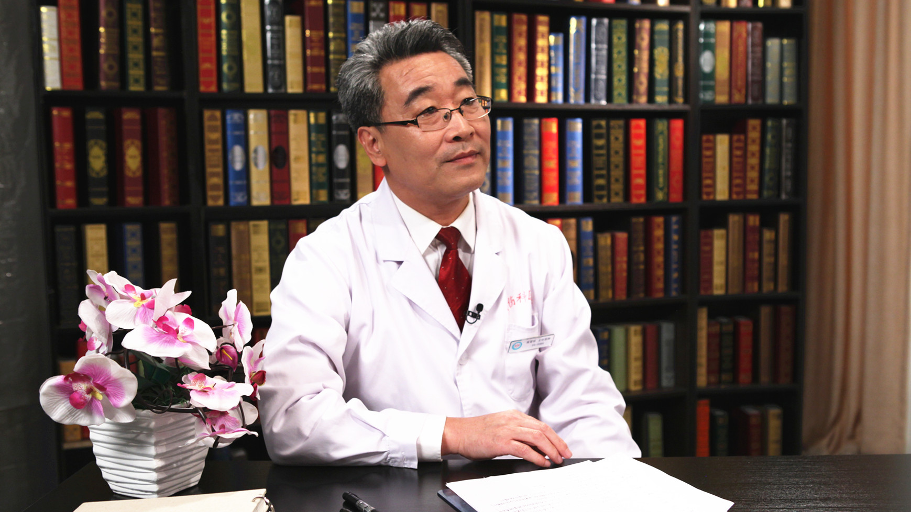

# 28.46 退行性脊柱侧凸

---

## 高景华 主任医师

中国中医科学院望京医院副院长 脊柱外科主任 主任医师 博士生导师。

中华中医药学会骨伤专业委员会常务委员；北京中西医结合学会骨伤科专业委员会常务委员；第四批全国名老中医（孙树椿）学术继承人。

**主要成就：** “中医综合疗法治疗神经根型颈椎病的临床和基础研究及推广”获2012年度北京市科学技术二等奖；“神经根型颈椎病中医综合治疗方案与手法评价系统”获2017年度国家科技进步二等奖；作为主要研究者参与了国家“十五”科技攻关、“十一五”科技支撑项目等多项课题；主持完成了中国中医科学院优势病种课题一项。

**专业特长：** 擅长应用中医中药、中医手法、针刀技术及手术疗法治疗脊柱及脊柱相关疾病（如腰椎间盘突出症、腰椎滑脱症、腰椎管狭窄症、颈椎病等），获得了满意的疗效。研究方向是神经根型颈椎病的中医诊疗、腰椎间盘病变的诊治、筋伤理论及筋伤手法。

---
