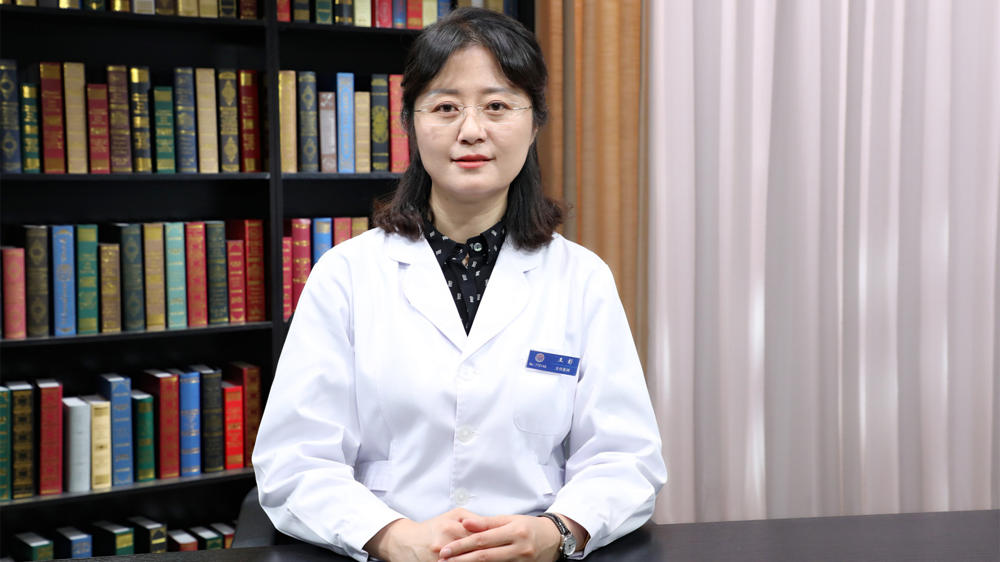

# 28.62 针灸治疗视神经萎缩

---

## 王影 主任医师

中国中医科学院眼科医院针灸科（神经眼科）主任 主任医师 硕士生导师 医学博士。

中华医学会眼科学分会专业委员会神经眼科学组委员；中华中医药学会眼科分会专业委员会委员；世界中医药学会联合会眼科专业委员会理事；中国临床试验安全与数据监查委员会常务理事；国家自然科学基金评审专家；《中国中医眼科杂志》编委。

**主要成就** ：全国中医药创新骨干人才，跟随国医大师唐由之研究员、首都名师庄曾渊研究员学习多年；发表SCI及核心期刊论文50余篇，主编及参与《国医大师系列丛书——唐由之经验集》《视神经萎缩中医药治疗》等著作；主持及参与国家等各级课题30余项。

**专业特长** ：擅长针灸等中西医结合疗法治疗神经眼科疾病。

---
