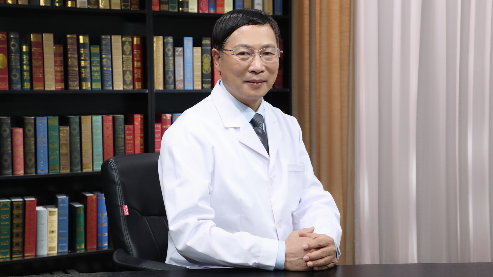

# 28.63 痔疮的中医治疗

---

## 贾小强 主任医师

中国中医科学院西苑医院外科教研室主任 肛肠科主任 主任医师 学科带头人。

北京中医药大学中西医结合外科学系副主任；中国医师协会中西医结合医师分会肛肠病学专家委员会主任委员；白求恩精神研究会肛肠分会会长；中国中医药研究促进会肛肠分会副会长；世界中医药学会联合会肛肠分会副会长；《中国肛肠病杂志》编委。

**主要成就：** 先后承担多项科研课题，获市级一等奖1项、省级三等奖1项、中国中医科学院三等奖1项，国家实用新型专利1项；发表学术论文60余篇，出版学术专著17部；曾在中央电视台、中国国际广播电台、北京人民广播电台、北京电视台、山东电视台、陕西电视台等媒体播出健康科普宣教节目。

**专业特长：** 擅长治疗结直肠肿瘤、便秘、重度痔、复杂肛瘘、直肠脱垂、肛周湿疹、肛裂等疾病。

---
