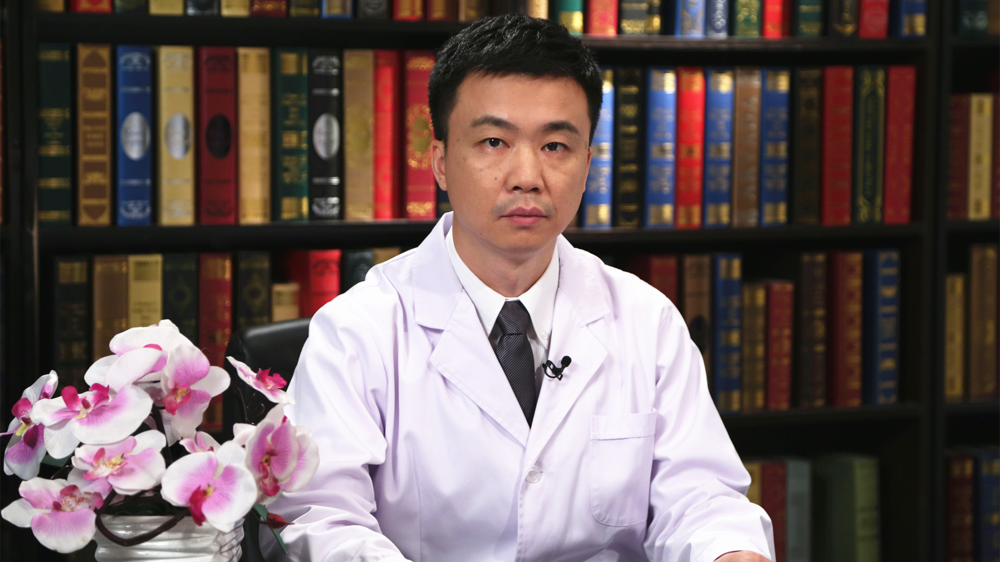

# 28.65 中成药的合理用药

---

## 鄢丹 主任药师

首都医科大学附属北京世纪坛医院药剂科副主任 主任药师 博士生导师。

临床合理用药生物特征谱学评价北京市重点实验室主任；北京中医药学会临床合理用药评价专业委员会主任委员；中华中医药学会中成药分会常务委员；世界中医药学会联合会中药上市后再评价专业委员会常务理事；《中国中药杂志》编委。

**主要成就：** 主研新药制剂研发项目5项，发表SCI论文48篇，出版专著6部，其中主编/副主编3部；主持国家自然科学基金项目优秀青年基金、国家“重大新药创制”重大专项等科研项目10项；获专利授权13项，秉持“源于临床—证于实验—归于临床”科研理念，开展结合临床的中药质量评价系统研究，推动了中药质量标准研究关键技术的突破与创新。

**专业特长：** 擅长临床合理用药评价、中药质量评价。

---
