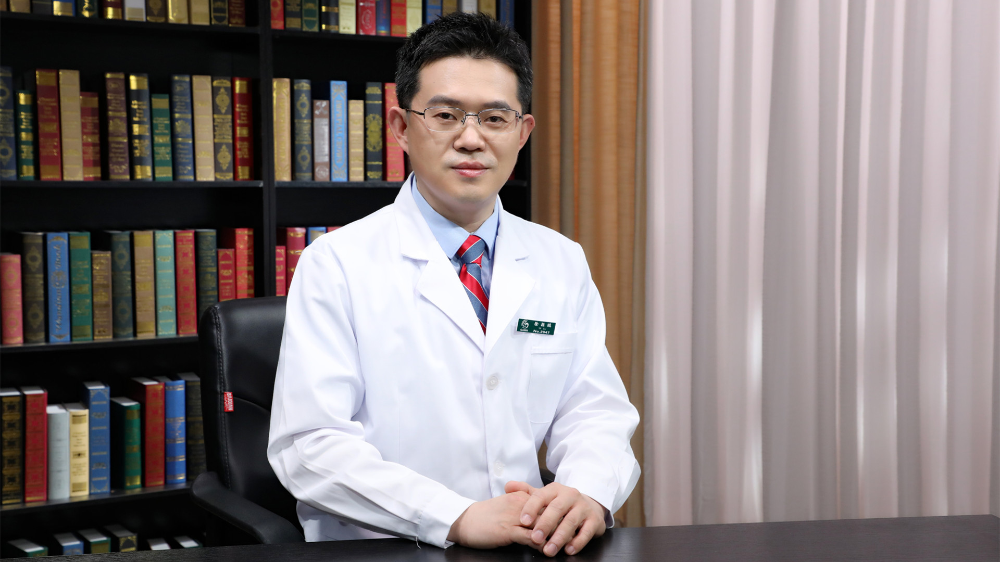

# 28.67 中西医结合微创治疗拇外翻

---

## 徐颖鹏 主任医师

中国中医科学院广安门医院骨科主任医师。

北京医学会运动医学分会委员；北京中西医结合学会骨科分会委员；中国中医药信息学会骨科分会理事；中国中西医结合学会骨伤科分会委员；中国人才研究会骨伤人才分会委员。

**主要成就：** 从事足踝、关节、运动创伤等疾病的临床、教学及科研工作10余年，师从著名中医骨伤专家、小切口截骨治疗拇趾外翻技术发明人、国家科学技术进步二等奖获得者温建民教授；2018年赴美国匹兹堡大学医学中心运动医学中心做访问学者，师从国际著名运动医学专家Freddie Fu教授；参与编写、翻译骨科书籍4部，作为主要成员参与国家自然科学基金、北京市科学技术委员会重大项目、首都医学发展科研基金项目等课题多项，在国内核心期刊发表文章10余篇。

**专业特长：** 擅长小切口截骨手法治疗拇外翻，关节镜微创治疗膝、髋、肩、肘、腕、踝关节退行性病变及运动创伤，椎体成形术治疗脊柱压缩性骨折，针刀治疗腱鞘炎、肌筋膜炎等慢性损伤，手法治疗颈椎病、腰椎间盘突出症。

---

---
