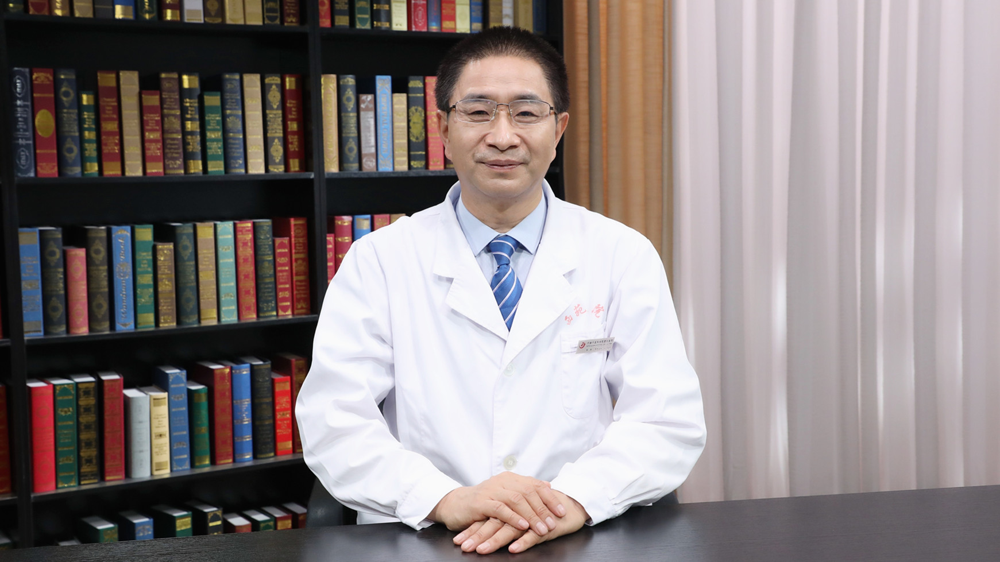

# 28.71 中西医结合治疗少弱畸形精子症

---

## 郭军 主任医师

中国中医科学院西苑医院男科主任 主任医师 教授 博士生导师。

中国中西医结合学会男科专业委员会副主任委员；中国中医药信息学会男科分会会长；北京中西医结合学会男科专业委员会主任委员；国家科技进步奖评审专家；国家自然科学基金评审专家；国家中医药管理局评审专家；北京科技进步奖评审专家。

**主要成就：** 先后主持承担多项国家及省部级科研课题，包含国家自然科学基金项目、科技部“十一五”支撑计划课题中医常见病等项目；以第一作者/通讯作者在国内外核心期刊发表论文70余篇，其中SCI 9篇；主编著作32部；构建“脑-心-肾-精室”轴在中医男科中的应用，丰富了中医泌尿男科理论。

**专业特长：** 临床擅长中西医结合诊治男性不育症（少弱畸形精子症、精液不液化、复发性流产男方因素等），前列腺疾病（前列腺炎、前列腺肥大、前列腺癌），性功能障碍，非淋菌性尿道炎等泌尿男科疾病。

---
