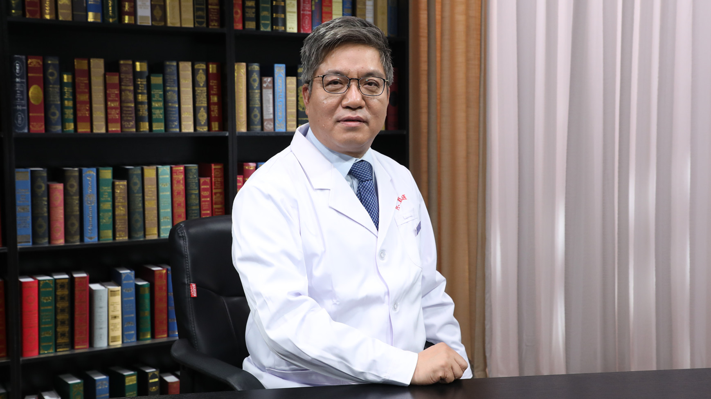

# 28.75 中药合理使用

---

## 华国栋 主任药师

北京中医药大学东直门医院药学部主任 主任药师 硕士生导师。

北京中医药学会中药工作委员会主任委员；中华中医药学会中药鉴定委员会副主任委员；中华中医药学会医院药学分会副主任委员；世界中医药学会联合会中药煮散研究专业委员会副会长；北京市中医管理局药剂质控和改进中心副主任委员。

**主要成就：** 发表学术论文30余篇，其中SCI收录1篇；主持在研课题3项：(1)国家重点研发计划“中医药现代化研究”重点专项子课题“甘草核心功效的物质基础与功用导向的质量标准研究”(2)横向课题“康莱特注射液安全性监测”(3)横向课题“经典名方当归六黄汤配方颗粒与传统汤剂指标性成分的一致性评价”；代表性论著：(1)16种植物挥发油对柏子仁黄曲霉菌的抑制作用考察，中国实验方剂学杂志，2020.3(2)基于高通量测序技术对市售柏子仁表面真菌多样性的研究，药学学报， 2019.11(3)中药不良反应分析，医药导报，2018.12。

**专业特长：** 研究方向与重点领域为临床药学、中药合理使用。

---
