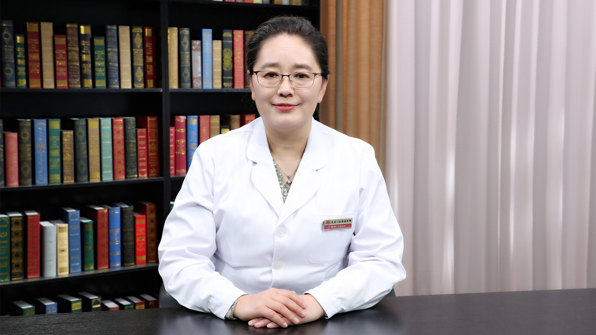

# 28.78 中医节气养生

---

## 于国泳 主任医师

北京中医药大学东直门医院治未病中心主任 主任医师 副教授 硕士生导师。

北京中医药大学五运六气与临床应用研究所执行所长；中国中医药信息学会中医药原创技术分会会长；国家中医药管理局预防保健重点专科负责人；北京中医药学会五运六气专业委员会副主任委员 秘书长；北京中西医结合学会医养结合专业委员会副主任委员。

**主要成就：** 发表学术论文30余篇；承担包括国家自然基金在内的省部级课题30余项，获批专利6项；主持或主要参加标准制定10余项，主编、参编书籍10余部。

**专业擅长：** 擅长运用五运六气理论治疗糖尿病及其并发症、急慢性肾脏疾病、甲状腺疾病、风湿免疫病、高尿酸血症，以及慢病调养。

---
