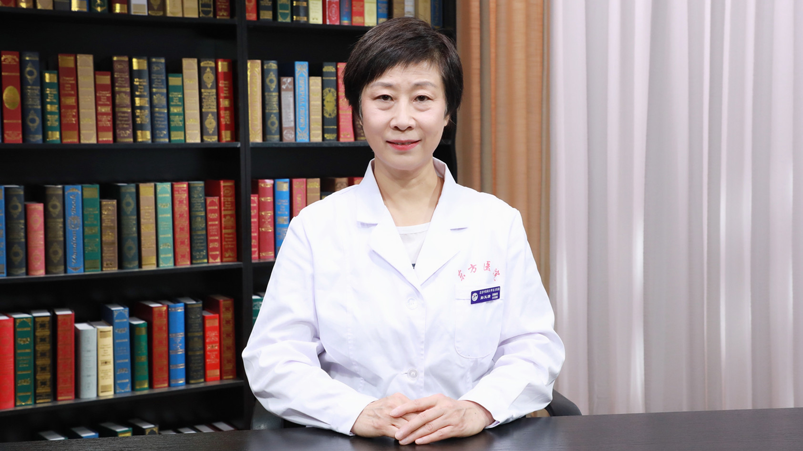

# 28.79 中医调理亚健康-疲劳

---

## 彭玉清 主任医师

北京中医药大学东方医院治未病中心亚健康科主任 主任医师 硕士生导师。

中华中医药学会治未病分会副主任委员；中华中医药学会亚健康分会常务委员；中华中医药学会慢病管理分会常务委员；中国民族医药学会国际交流与合作分会常务委员兼副秘书长；中国民族医药学会疑难病分会常务委员。

**主要成就：** 发表学术论文30余篇，主编科普及专业书籍30余册。

**专业特长：** 精通中西医双套诊疗体系，以系统性多学科综合诊疗疾病为专长；擅长心脑血管及周围血管、动脉硬化、高血压、冠心病、糖尿病血管疾病的诊断与治疗，以及对慢性疲劳、女性亚健康人群的调理。

---
