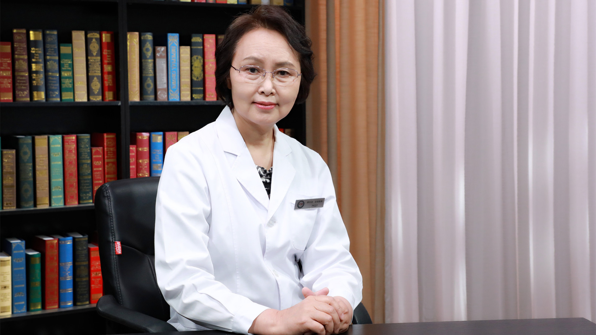

# 28.80 中医调脾胃

---

## 李方洁 主任医师

中国中医科学院望京医院心功能科主任 主任医师 教授 博士生导师 首都名中医。

北京中医药大学临床特聘专家；北京市老中医药专家学术经验继承工作指导老师；中国心电学会心电散点图专业委员会主任委员；中国医药卫生文化协会女性健康文化分会副会长。

**主要成就：** 主持完成国家及省部级科研项目10项；发表专业学术论文近百篇，具有创新性导向性论文20余篇，创新性专著2部；致力于中医心病（“双心疾病”）、国医大师学术思想和临床经验传承、心电学诊断新技术的研究，曾获国家及行业学会二等奖和三等奖。

**专业特长：** 擅长中医心病（“双心疾病”）和各种原因所导致的胸闷胸痛、心悸气短、失眠健忘、神疲乏力、惊烦焦虑、久咳哮喘、头痛头胀、眩晕耳鸣、消渴善饥、胃痛腹胀、泄泻便秘、水湿肿满、自汗盗汗、口腔溃疡、咽痛鼻塞等疑难杂病和常见妇科疾病的中医及中西医结合治疗。

---
