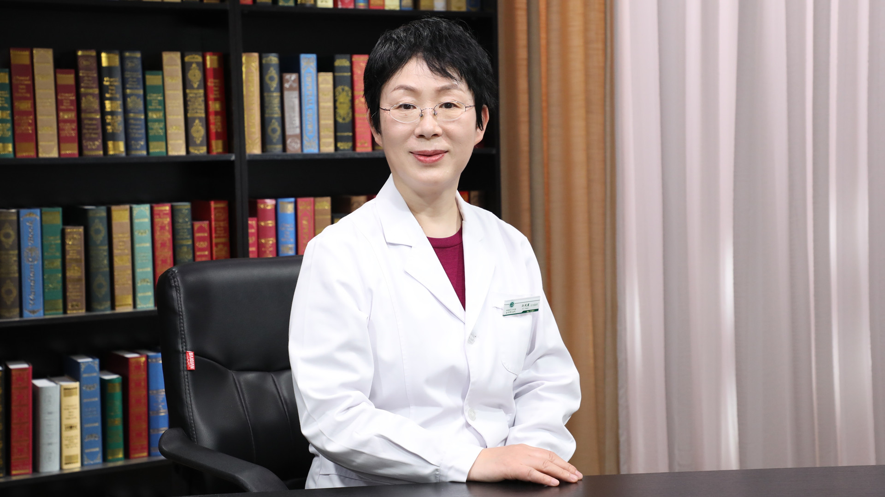

# 28.81 中医养肝

---

## 孙凤霞 主任医师

首都医科大学附属北京中医医院感染科主任 主任医师 博士生导师。

北京中医药学会肝病专业委员会主任委员； 北京中医药学会感染病专业委员会副主任委员； 世界中医药学会联合会肿瘤外治法专业委员会副会长； 中国中西医结合学会感染病专业委员会常务委员 ；《中西医结合肝病杂志》编委会常务委员 。

**主要成就：** 以第一作者及通讯作者发表医学核心期刊表论文70余篇，参与《内科诊断治疗学》《SARS的临床诊断与治疗》《危急重症临床急救手册》等著作的编写；先后承担国家自然科学基金课题、国家中医药管理局基地课题、北京市级科研课题多项，国家科技部“十一五”“十二五”“十三五”传染病重大专三项分课题负责人；国家中医药管理局第三批全国优秀中医临床人才，北京市卫生局“215”高层次卫生技术人才学科骨干，北京市中医药管理局“125计划”优秀人才。

**专业特长：** 擅长中西医结合治疗肝硬化、肝癌、慢性乙型肝炎、丙型肝炎、胆汁淤积性肝病、自身免疫性肝病、脂肪肝、酒精肝等各种原因的肝病。

---
