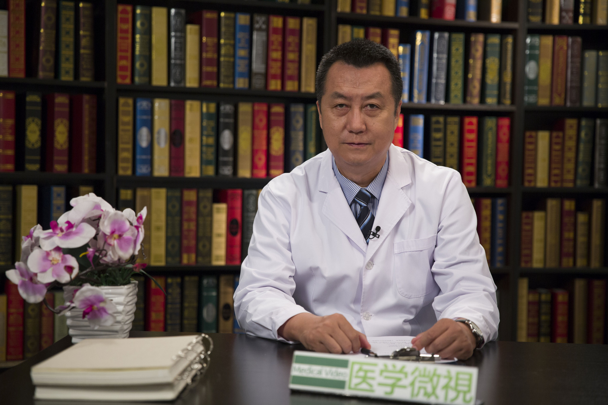

# 28.85 中医治疗干眼症

---

## 邱礼新 主任医师

首都医科大学附属北京同仁医院眼科中心中医眼科主任 主任中医师 中医眼科学博士。

北京市中西医结合眼科研究所副所长；中华中医药学会眼科分会副主任委员；世界中医药学会联合会眼科专业委员会理事会副会长。

**主要成就：** 全国名老中医学术继承人，师从于眼科名家唐由之先生；发表论文10余篇，主编眼科学术著作1部，参编6部。

**专业特长：** 从事中医眼科临床20余年，中医基本理论扎实，精研《伤寒杂病论》多年，运用经方与时方相结合，治疗部分常见难治性眼病，有较好疗效。

---
