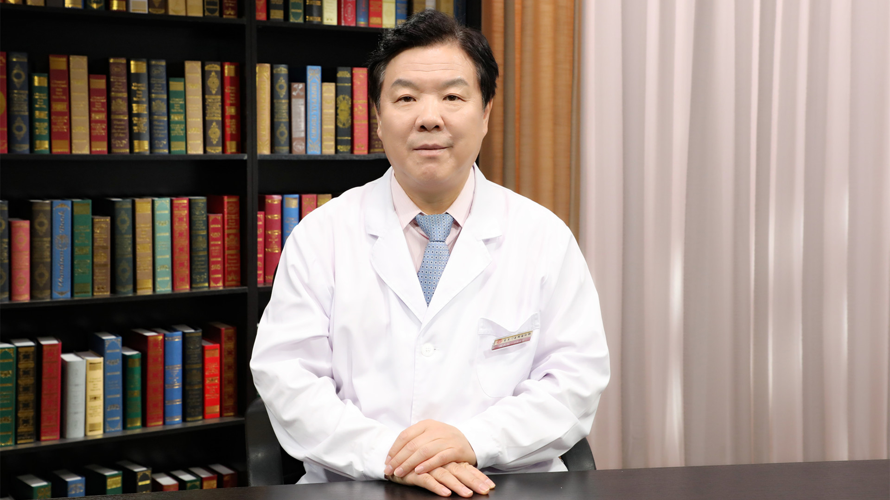

# 28.93 中医治疗三叉神经痛

---

## 刘长信 主任医师

北京中医药大学东直门医院推拿疼痛科主任 主任医师 教授 硕士生导师.

北京中医药大学推拿临床学系主任 ；中华中医药学会疼痛学分会创始主任委员；中华中医药学会疼痛与康复学术产业联盟主席；北京中医药学会疼痛专业委员会主任委员；北京中医药学会推拿专业委员会副主任委员；中国民族医药学会推拿分会执行主任委员；中国医学装备协会中医装备分会会长。

**主要成就：** 发表学术专业论文28篇，著书15部；主持国家自然科学基金课题1项，校级课题4项，局级课题3项，部级课题4项；获国家级专利3项，发明医疗器械1项并成功转让，音像制品3项；获“第二届首都群众喜爱的中青年名中医”称号、2013年首届新华网“中国好医生”入围提名奖。

**专业特长：** 传承和发明了宫廷五联疗法即宫廷理筋术、宫廷一罐通术、宫廷药灸术、宫廷腿疗术、宫廷拔寒祛痛贴敷术，擅长使用宫廷五联疗法加中医微创技术、中药内服治疗顽固性颈肩腰腿痛、痛风、风湿性关节炎、类风湿关节炎、强直性脊柱炎等骨伤疾患；部分内脏疾患如失眠、便秘、三高症等。

---
