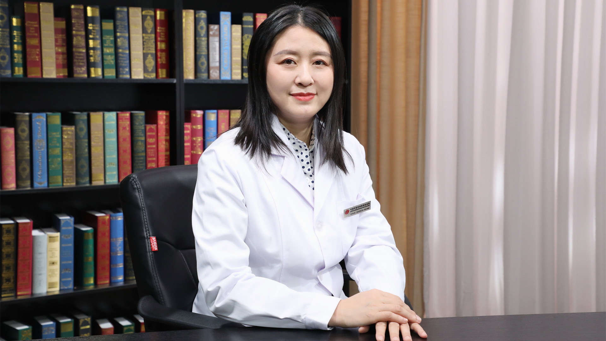

# 28.94 中医治疗手抖

---

## 孙林娟 主任医师

中国中医科学院西苑医院脑病科副主任 主任医师 医学博士 硕士生导师.

新疆生产建设兵团第十三师红星医院挂职副院长；中国老年保健协会脑保健专业委员会副主任委员；中国医师协会中西医结合医师分会神经病学学术委员会常务委员；中国卒中学会中西医结合分会会员。

**主要成就：** 主持中国中医科学院科技创新工程（C12021A01302）1项、中国中医科学院研究生院教学课题1项、中国中医科学院项目1项、国家自然科学基金项目2项、横向课题2项、中国中医科学院西苑医院课题1项；在国内外发表学术论文30余篇，其中英文文章2篇。

**专业特长：** 擅长手抖、动作慢、记忆力减退、中风、头痛、头晕、失眠、面瘫、帕金森病、痴呆及疑难病的诊断和中西医结合治疗。

---
