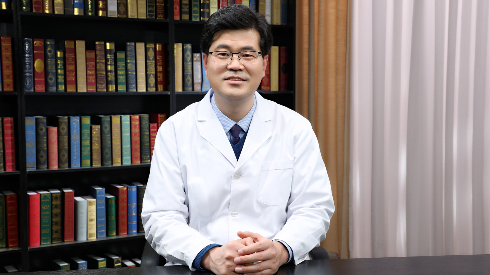

# 28.100 中医治疗腰椎管狭窄症

---

## 张兆杰 主任医师

中国中医科学院望京医院脊柱一科主任医师 副教授 医学博士 硕士生导师。

北京市名老中医周卫教授学术经验继承人；中国中医药研究促进会青年医师分会副会长；中国康复医学会颈椎病专业委员会第一届青年委员会委员；中国中西医结合学会脊柱医学专业委员会委员 秘书；北京市中西医结合学会第一届宫廷正骨学术研究专业委员会委员。

**主要成就：** 主持参与国家级、院级各项课题11项，发表核心期刊论文30余篇；在《北京中医药》发表的“疏筋整复手法治疗寰枢椎关节紊乱导致的颈性眩晕临床研究”一文，作为中医药标志性成果写入2015年《中国中医药年鉴》之中；2016年由国家卫生健康委员会和中国医师协会评选为“人民好医生”，国家卫生健康委员会百姓健康频道“健康卫士”，“人民好医生”专家团团长；荣获全国中医药系统2018-2020年先进典范。

**专业特长：** 从事中西医结合脊柱科临床、科研、教学工作，临床工作中始终把辨证与辨病结合起来，把手术治疗与非手术治疗结合起来；擅长采用现代手术、阴阳平衡系列手法、针灸、中药等中西医结合方法，治疗各种骨伤科相关疾患，尤其是各型颈椎病、寰枢关节紊乱导致的颈性眩晕、腰椎间盘突出症、腰椎滑脱症、腰椎管狭窄症、肩周炎等颈肩腰腿疼痛疾患。

---
